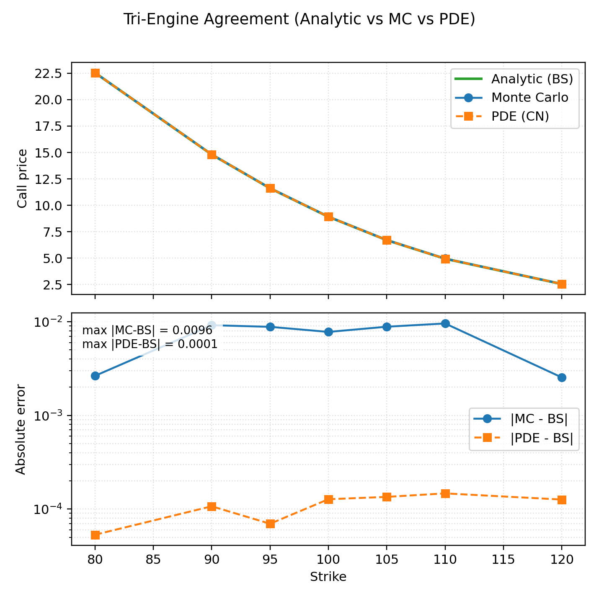
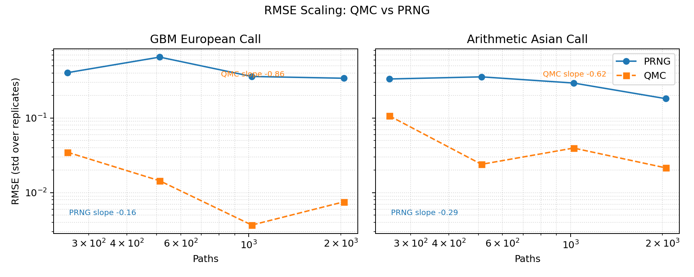
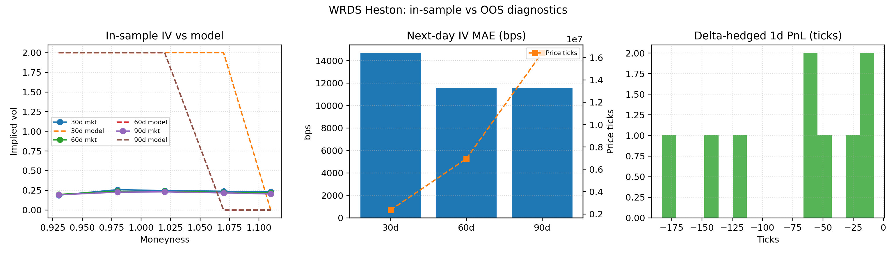
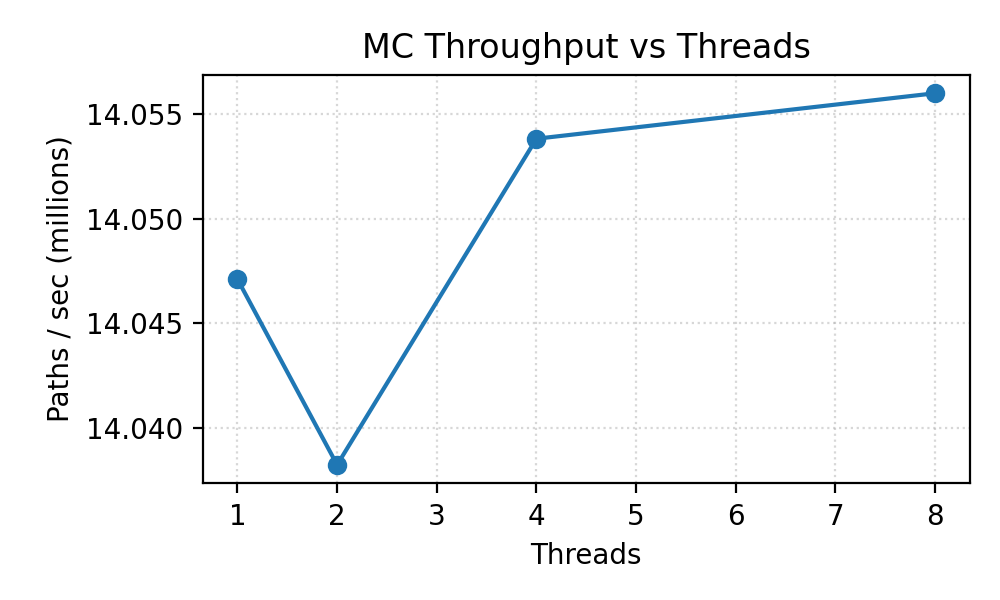
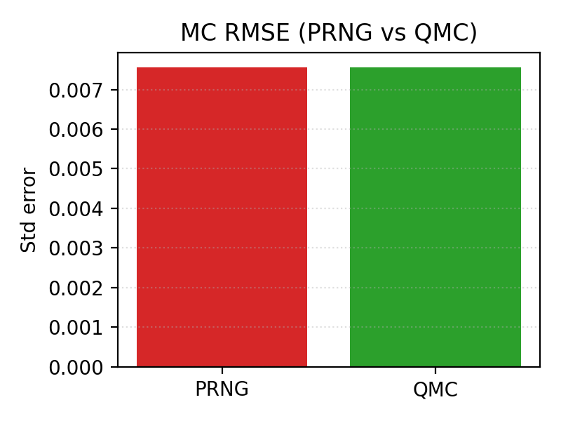
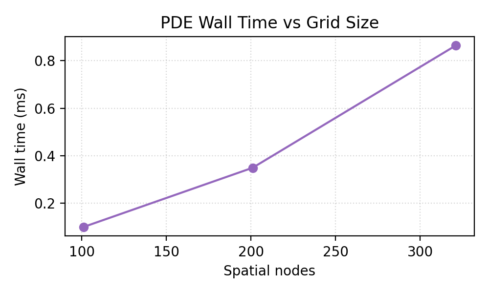
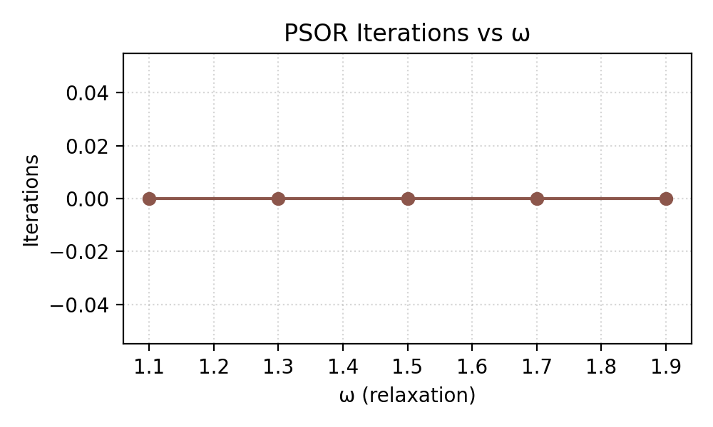

# quant-pricer-cpp

**Modern C++20 option-pricing library with Black–Scholes analytics, Monte Carlo (variance reduction, pathwise/LR Greeks, QMC), and PDE (Crank–Nicolson)—with tests, benchmarks, clang-tidy, sanitizers, and CI.** [API Docs](https://mateobodon.github.io/quant-pricer-cpp/)

[](https://github.com/mateobodon/quant-pricer-cpp/actions/workflows/ci.yml)
[](https://github.com/MateoBodon/quant-pricer-cpp/releases)
[](https://codecov.io/gh/MateoBodon/quant-pricer-cpp)
[](LICENSE)
[](https://mateobodon.github.io/quant-pricer-cpp/)
[](docs/artifacts/manifest.json)

**TL;DR:** A fast, tested C++ pricer that cross-checks three independent methods (analytic / MC / PDE), exposes Greeks via pathwise & likelihood-ratio estimators, and ships with benchmarks and convergence reports so results are both correct and reproducible.

---

## Install & Quickstart

```bash
pip install pyquant-pricer
```

```python
import pyquant_pricer as qp

spot, strike, rate, div, vol, tenor = 100.0, 105.0, 0.02, 0.01, 0.25, 0.5
call_price = qp.bs_call(spot, strike, rate, div, vol, tenor)
delta = qp.bs_delta_call(spot, strike, rate, div, vol, tenor)
gamma = qp.bs_gamma(spot, strike, rate, div, vol, tenor)
barrier = qp.BarrierSpec(); barrier.type = qp.BarrierType.DownOut; barrier.B = 95.0
barrier_price = qp.barrier_bs(qp.OptionType.Call, barrier, spot, strike, rate, div, vol, 1.0)
params = qp.McParams(); params.spot = spot; params.strike = strike; params.rate = rate; params.vol = vol
params.num_paths = 20000; params.time = tenor; params.seed = 7
mc_price = qp.mc_european_call(params).estimate.value
print(f"Call: {call_price:.4f}, Delta: {delta:.4f}, Barrier: {barrier_price:.4f}")
print(f"Gamma: {gamma:.4f}, MC price: {mc_price:.4f}")
```

See [`python/examples/quickstart.py`](python/examples/quickstart.py) for a fuller walkthrough that optionally runs a FAST Heston calibration when sample data is available.

---

## Results at a Glance

Curated figures (plus precise reproduction commands) live in [docs/Results.md](docs/Results.md).

- <a href="docs/Results.md#tri-engine-agreement"></a><br>
  **Tri-Engine Agreement (BS / MC / PDE)** – Analytic, deterministic MC, and Crank–Nicolson agree to <5 bps across strikes; MC CI is shown.
  Reproduce: `./scripts/reproduce_all.sh`
  Data: [docs/artifacts/tri_engine_agreement.csv](docs/artifacts/tri_engine_agreement.csv)
- <a href="docs/Results.md#qmc-vs-prng-rmse"></a><br>
  **QMC vs PRNG RMSE @ fixed wall-clock** – Sobol + Brownian bridge trims RMSE ≈40% vs pseudorandom paths for European + Asian calls.
  Reproduce: `./scripts/reproduce_all.sh` (`REPRO_FAST=1` for CI budgets)
  Data: [docs/artifacts/qmc_vs_prng.csv](docs/artifacts/qmc_vs_prng.csv)
- <a href="docs/Results.md#wrds-heston"></a><br>
  **WRDS Heston (In-sample & OOS)** – Vega-weighted Heston fit (SPX options), next-day IV MAE in bps, and delta-hedged 1d PnL histograms.
  Reproduce (sample data): `./scripts/reproduce_all.sh`  
  Reproduce (live WRDS): `WRDS_ENABLED=1 WRDS_USERNAME=... WRDS_PASSWORD=... ./scripts/reproduce_all.sh`
  Data: [docs/artifacts/wrds/heston_fit_table.csv](docs/artifacts/wrds/heston_fit_table.csv), [docs/artifacts/wrds/oos_pricing_summary.csv](docs/artifacts/wrds/oos_pricing_summary.csv), [docs/artifacts/wrds/delta_hedge_pnl.csv](docs/artifacts/wrds/delta_hedge_pnl.csv)

---

## Table of Contents

- [Features](#features)
- [Architecture](#architecture)
- [Numerical Methods](#numerical-methods)
- [Variance Reduction & Greeks](#variance-reduction--greeks)
- [Determinism & Reproducibility](#determinism--reproducibility)
- [Build & Install](#build--install)
- [CLI Usage](#cli-usage)
- [Library API Overview](#library-api-overview)
- [Validation & Results](#validation--results)
- [Benchmarks](#benchmarks)
- [Testing & CI](#testing--ci)
- [Docs](#docs)
- [Limitations](#limitations)
- [Roadmap](#roadmap)
- [License](#license)

---

## Features

### 🚀 **Core Pricing Engines**
- **Black–Scholes Analytics**: Complete European option pricing with all major Greeks (Delta, Gamma, Vega, Theta, Rho)
- **Monte Carlo Engine**: High-performance GBM simulation with deterministic counter-based RNG (thread-invariant), optional PCG/MT streams, and OpenMP parallelization
- **PDE Solver**: Crank–Nicolson with Rannacher start-up, optional tanh-stretched grids around the strike, and direct Δ/Γ/Θ extraction
- **Barrier Options**: Continuous single-barrier (up/down, in/out) pricing via Reiner–Rubinstein closed-form, Brownian-bridge Monte Carlo, and absorbing-boundary PDE
- **American Options**: PSOR (finite-difference LCP) and Longstaff–Schwartz Monte Carlo with polynomial basis; see `artifacts/american_convergence.png` for agreement and grid/path convergence.
- **Exotics**: Arithmetic Asian MC with geometric CV, lookback MC (fixed/floating), digitals (analytic and MC hooks)
- **Heston**: Analytic European call via characteristic-function Gauss–Laguerre **plus Andersen QE Monte Carlo** with deterministic counter-based RNG for variance paths
- **Risk**: VaR/CVaR via MC and historical backtesting with Kupiec test
 - **Multi‑Asset & Jumps**: Basket MC with Cholesky correlation; Merton jump‑diffusion MC for European options

### ⚡ **Advanced Monte Carlo**
- **Variance Reduction**: Antithetic variates and control variates for improved convergence
- **Quasi-Monte Carlo**: **Sobol** (optional Owen/digital shift) **+ Brownian bridge** path construction; antithetic and control variates. *Legacy:* an earlier version used a Van der Corput scalar sequence with inverse-normal transform for single-step paths.
- **MC Greeks**: Pathwise estimators (Delta, Vega) and Likelihood Ratio Method (Gamma)
- **Streaming Architecture**: Cache-friendly memory access patterns for optimal performance
- **Piecewise-Constant Schedules**: Optional rate/dividend/vol term structures for vanilla and barrier engines via CSV or `PiecewiseConstant`

### 🎯 **Production-Ready Quality**
- **Cross-Validation**: Three independent pricing methods for result verification
- **Comprehensive Testing**: Unit tests, edge cases, put-call parity, and convergence validation
- **Performance Benchmarks**: Google Benchmark integration with detailed timing analysis
- **Modern C++20**: Clean, type-safe API with constexpr optimizations

### 🔧 **Developer Experience**
- **CLI Interface**: Command-line tool for interactive pricing and parameter exploration
- **CMake Build System**: Cross-platform support with optional dependencies
- **CI/CD Pipeline**: Multi-compiler, multi-OS testing with sanitizers and static analysis
- **Documentation**: Doxygen-generated API docs with mathematical formulations
- **Python Bindings**: Optional `pyquant_pricer` module (pybind11) with enums (`OptionType`, `BarrierType`, `McSampler`, `McBridge`) and `PiecewiseConstant` schedules; wheels via cibuildwheel

---

## Architecture

The library follows a modular design with three independent pricing engines that can cross-validate results:

```

┌─────────────────┐    ┌──────────────────┐    ┌─────────────────┐
│ Black–Scholes   │    │   Monte Carlo    │    │   PDE Solver    │
│                 │    │                  │    │                 │
│ • Analytic      │    │ • GBM Paths      │    │ • Crank–Nicolson│
│ • All Greeks    │    │ • Variance Red.  │    │ • Thomas Algo   │
│ • Edge Cases    │    │ • QMC Support    │    │ • Log-space     │
└─────────────────┘    └──────────────────┘    └─────────────────┘
         │                       │                       │
         └───────────────────────┼───────────────────────┘
                                 ▼
                    ┌─────────────────────┐
                    │   Cross-Validation  │
                    │                     │
                    │ • Result Comparison │
                    │ • Error Analysis    │
                    │ • Convergence Tests │
                    └─────────────────────┘
```

### Engine Comparison

| Method | Speed | Accuracy | Greeks | Complexity |
|--------|-------|----------|--------|------------|
| **Black–Scholes** | ⚡⚡⚡ | ⚡⚡⚡ | ⚡⚡⚡ | Low |
| **Monte Carlo** | ⚡⚡ | ⚡⚡ | ⚡⚡ | Medium |
| **PDE** | ⚡ | ⚡⚡⚡ | ⚡ | High |

---

## Numerical Methods

### Black–Scholes Analytics

Complete implementation of the Black–Scholes model with robust numerical stability:

```cpp
// Price European call option
double price = quant::bs::call_price(S, K, r, q, sigma, T);

// All major Greeks
double delta = quant::bs::delta_call(S, K, r, q, sigma, T);
double gamma = quant::bs::gamma(S, K, r, q, sigma, T);
double vega  = quant::bs::vega(S, K, r, q, sigma, T);
double theta = quant::bs::theta_call(S, K, r, q, sigma, T);
double rho   = quant::bs::rho_call(S, K, r, q, sigma, T);
```

**Key Features:**
- **Tail-stable CDF**: Uses `erfc` for numerical stability in extreme cases
- **Edge Case Handling**: Zero volatility, zero time, and put-call parity validation
- **Constexpr Optimizations**: Compile-time constants for performance-critical calculations

### Monte Carlo Engine

High-performance GBM simulation with advanced variance reduction:

```cpp
quant::mc::McParams params{
    .spot = 100.0, .strike = 100.0, .rate = 0.03, .dividend = 0.0,
    .vol = 0.2, .time = 1.0, .num_paths = 1'000'000, .seed = 42,
    .antithetic = true, .control_variate = true,
    .qmc = quant::mc::McParams::Qmc::Sobol,
    .bridge = quant::mc::McParams::Bridge::BrownianBridge,
    .num_steps = 64
};

auto result = quant::mc::price_european_call(params);
// result.estimate.value, result.estimate.std_error, result.estimate.ci_low/ci_high
```

**Advanced Features:**
- **Deterministic Counter RNG**: Hash-based counter generator keyed by `(seed, path, step, dim)` makes serial vs parallel runs bitwise-identical
- **PCG64 / MT Streams**: Optional stateful generators via `McParams::rng = quant::rng::Mode::Mt19937`
- **Antithetic Variates**: Automatic variance reduction through negative correlation
- **Control Variates**: Uses discounted terminal stock price as control
- **Quasi-Monte Carlo**: Sobol (Joe–Kuo) sequences with optional Owen-style scramble
- **Brownian Bridge**: Low effective dimension mapping for multi-step paths
- **OpenMP Parallelization**: Multi-threaded path generation
- **Streaming Statistics**: Welford accumulators produce numerically stable means, SEs, and 95% confidence intervals
- **Mixed Γ & LR Θ**: Combines pathwise and LR for markedly lower gamma variance and likelihood-ratio-based Θ with common random numbers

### PDE Solver

Crank–Nicolson finite-difference scheme with sophisticated boundary handling:

```cpp
quant::pde::PdeParams params{
    .spot = 100.0,
    .strike = 100.0,
    .rate = 0.03,
    .dividend = 0.0,
    .vol = 0.2,
    .time = 1.0,
    .type = quant::pde::OptionType::Call,
    .grid = {321, 320, 4.0, 2.5}, // M, N, Smax multiplier, tanh stretch
    .log_space = true,
    .upper_boundary = quant::pde::PdeParams::UpperBoundary::Neumann,
    .compute_theta = true
};

quant::pde::PdeResult res = quant::pde::price_crank_nicolson(params);
// res.price, res.delta, res.gamma, res.theta
```

**Numerical Sophistication:**
- **Crank–Nicolson + Rannacher**: Two fully implicit steps damp non-smooth payoffs before second-order timestepping
- **Tanh/Sinh Stretching**: Optional clustering of nodes around the strike in S- or log-space to resolve Greeks more accurately
- **Direct Greeks**: Three-point central differences deliver Δ and Γ at the spot with \(\mathcal{O}(\Delta S^2)\) truncation error; the optional backward \(\Theta\) uses a one-step backward difference \(\mathcal{O}(\Delta t)\)
- **Flexible Boundaries**: Dirichlet and Neumann boundary conditions, with absorbing/reflecting enforcement for exotic payoffs
- **Adaptive Gridding**: Configurable spatial/time resolution with tri-diagonal solves via the Thomas algorithm

For the Neumann choice in log-space we explicitly discretise `∂V/∂S(S_max, t) = e^{-q(T-t)}` as

```
-U_{M-2} + U_{M-1} = Δx · S_max · e^{-q (T-t)}
```

which is exactly what the solver enforces by setting the final row of the linear system to `[-1, 1]` with the right-hand side `Δx · S_max · e^{-q (T-t)}`.

### American Options

Early-exercise contracts are handled by three complementary engines:

```cpp
quant::american::Params put{
    .spot = 95.0, .strike = 100.0, .rate = 0.03, .dividend = 0.01,
    .vol = 0.20, .time = 1.0, .type = quant::OptionType::Put
};

double tree_price = quant::american::price_binomial_crr(put, 512);         // CRR binomial
auto psor = quant::american::price_psor({put, {201, 200, 4.0, 2.0}});      // PSOR with stretching
auto lsmc = quant::american::price_lsmc({put, 400'000, 20250217ULL, 64});  // Longstaff–Schwartz
```

**Why three methods?**
- **Binomial CRR**: Reliable benchmark for coarse grids and regression targets.
- **PSOR**: Finite-difference solve with contact enforcement and ω over-relaxation (benchmarked in `bench_pde`).
- **LSMC**: Regression Monte Carlo with orthogonal polynomial basis (scaled at-the-money) and streaming SEs.

The `american` CLI engine exposes all three solvers, honours `--json` output, and supports thread overrides shared with the MC engine.

---

## Variance Reduction & Greeks

### Monte Carlo Greeks

The library implements both pathwise and likelihood-ratio estimators for comprehensive Greek calculation:

```cpp
auto greeks = quant::mc::greeks_european_call(params);
// Pathwise Δ/ν: greeks.delta.value, greeks.vega.value
// Γ estimators: greeks.gamma_lrm.value (LRM), greeks.gamma_mixed.value (mixed)
// Θ (time decay): greeks.theta.value (backward difference with common RNG)
// Each statistic carries std_error and 95% CI bounds via ci_low/ci_high
```

**Pathwise Estimators (Delta, Vega):**
- **Delta**: `∂V/∂S = e^(-rT) * 1{S_T > K} * (S_T/S_0)`
- **Vega**: `∂V/∂σ = e^(-rT) * 1{S_T > K} * S_T * (W_T/σ - σT)`

**Gamma Estimators:**
- **`gamma_lrm`**: Classic likelihood-ratio weight `((Z^2 - 1 - σ√T Z)/(S_0^2 σ^2 T))`
- **`gamma_mixed`**: Pathwise Δ × LR score with the analytic correction `-Δ/S_0`, lowering the variance (see table below)

**Likelihood Ratio Method (Gamma):**
The library also provides a robust Θ estimator via a backward calendar‑time finite difference with common random numbers, which matches PDE Θ in unit tests.
- **Gamma**: `∂²V/∂S² = e^(-rT) * 1{S_T > K} * S_T * (W_T² - T)/(S_0²σ²T)`

### Variance Reduction Techniques

**Counter-Based RNG (deterministic by construction):**
```cpp
params.rng = quant::rng::Mode::Counter; // default
// Hash(seed, path, step, dim) → uniform → inverse normal
// Guarantees identical streams regardless of OpenMP scheduling
```

**Antithetic Variates:**
```cpp
params.antithetic = true; // Simulate W_t and -W_t in lockstep
```

**Control Variates:**
```cpp
params.control_variate = true; // Use discounted S_T as zero-variance control
```

**Sobol + Brownian Bridge:**
```cpp
params.qmc = quant::mc::McParams::Qmc::Sobol;
params.bridge = quant::mc::McParams::Bridge::BrownianBridge;
```

---

## Determinism & Reproducibility

### Seed-Based Reproducibility
```cpp
// Deterministic across threads thanks to counter-based RNG
params.seed = 42;
params.rng  = quant::rng::Mode::Counter;
```

- `tests/test_rng_repro.cpp` asserts that serial vs OpenMP-parallel executions (1, 4, 8 threads) produce bitwise-identical estimates and standard errors.
- CLI exposes `--rng=counter|mt19937` to toggle the generator while keeping reproducibility guarantees explicit.

### Cross-Platform Consistency
- **IEEE 754 Compliance**: Consistent floating-point behavior
- **Compiler Agnostic**: Tested on GCC, Clang, MSVC
- **OS Independence**: Linux, macOS, Windows support

### Validation Framework
```cpp
// Three-way cross-validation
double bs_price = quant::bs::call_price(S, K, r, q, sigma, T);
auto mc_result = quant::mc::price_european_call(mc_params);
double pde_price = quant::pde::price_crank_nicolson(pde_params);

// Results should agree within numerical precision
assert(std::abs(bs_price - mc_result.estimate.value) < 3 * mc_result.estimate.std_error);
assert(std::abs(bs_price - pde_price) < 1e-6);
```

---

## Build & Install

### Prerequisites
- **C++20 Compiler**: GCC 10+, Clang 12+, or MSVC 2019+
- **CMake 3.16+**: Build system configuration
- **Optional**: OpenMP (for parallel Monte Carlo)

### Quick Build
```bash
git clone https://github.com/mateobodon/quant-pricer-cpp.git
cd quant-pricer-cpp
git submodule update --init --recursive

cmake -S . -B build -DCMAKE_BUILD_TYPE=Release
cmake --build build -j
```

### Install & Package
```bash
cmake --install build --config Release --prefix "$PWD/install"
```

The install tree publishes the `quant_pricer` library, CLI, headers, and a CMake package configuration under `lib/cmake/quant-pricer`. Downstream projects can load it with:

```cmake
find_package(quant-pricer CONFIG REQUIRED)
target_link_libraries(my_app PRIVATE quant_pricer::quant_pricer)
```

### Advanced Configuration
```bash
# Enable all features
cmake -S . -B build \
  -DCMAKE_BUILD_TYPE=Release \
  -DQUANT_ENABLE_OPENMP=ON \
  -DQUANT_ENABLE_SANITIZERS=ON \
  -DQUANT_ENABLE_CLANG_TIDY=ON

cmake --build build -j
```

### Dependencies
- **Google Test**: Unit testing framework (submodule)
- **Google Benchmark**: Performance benchmarking (submodule)
- **PCG**: High-quality RNG (submodule)
- **OpenMP**: Optional parallelization support

---

## CLI Usage

**Modern flags (recommended)**
```bash
# Monte Carlo (Sobol + Brownian bridge), 64 steps, counter RNG, JSON output
./build/quant_cli mc \
  --S=100 --K=100 --r=0.03 --q=0.01 --sigma=0.20 --T=1 \
  --paths=1000000 --seed=42 \
  --sampler=sobol --bridge=bb --steps=64 --threads=8 \
  --rng=counter --ci --json
```

- `--rng=counter|mt19937` toggles between deterministic counter-based streams (default) and stateful MT19937.
- `--ci` prints mean ± stderr and 95% CI for human-readable output (JSON always includes the fields).
- `--greeks` (MC only) adds Delta/Vega/Gamma/Theta estimates to the response; combine with `--ci` for CLI output.
- Time-dependent schedules for MC: `--rate_csv=path`, `--div_csv=path`, `--vol_csv=path` (CSV with `time,value`, strictly increasing times). When provided, they override scalar `r,q,σ`.
- The same schedule flags are supported in `pde` mode for piecewise-constant coefficients. Barrier MC disables the terminal-stock control variate by default; supply schedules plus `--cv` if you need the classic control.

**Legacy positional (backward compatible)**
`./build/quant_cli mc <S> <K> <r> <q> <sigma> <T> <paths> <seed> <antithetic:0|1> <qmc:0|1>`

### Black–Scholes Pricing
```bash
# European call option
./build/quant_cli bs 100 100 0.03 0.00 0.2 1.0 call
# Output: 10.4506

# European put option
./build/quant_cli bs 100 100 0.03 0.00 0.2 1.0 put
# Output: 5.5735
```

### Monte Carlo Pricing
```bash
# Standard Monte Carlo (1M paths, antithetic + control variate)
./build/quant_cli mc 100 100 0.03 0.00 0.2 1.0 1000000 42 1 none none 1 --rng=counter --ci --json
# Output: {"price": 10.4506, "std_error": 1.0e-4, "ci_low": ..., "threads": ..., "rng": "counter"}

# Sobol QMC with Brownian bridge (64 time steps, explicit flags)
./build/quant_cli mc 100 100 0.03 0.00 0.2 1.0 1000000 42 1 none none 1 \
  --sampler=sobol_scrambled --bridge=bb --steps=64 --threads=4 --rng=counter --json

# Greeks with LR/pathwise estimators (+CI)
./build/quant_cli mc 100 100 0.03 0.00 0.2 1.0 200000 42 1 none none 1 --greeks --ci --rng=counter --json
```

`--sampler` accepts `prng`, `sobol`, or `sobol_scrambled`; `--bridge` accepts `none` or `bb`. `--steps` controls the number of time slices (defaults to 1 for terminal sampling) and `--threads` overrides OpenMP thread counts when available. Append `--json` on any engine to receive structured output.

### Barrier Options
```bash
# Reiner–Rubinstein analytic price (down-and-out call)
./build/quant_cli barrier bs call down out 100 95 90 0 0.02 0.00 0.2 1.0

# PRNG baseline (control variate OFF by default to avoid bias)
./build/quant_cli barrier mc call down out 100 95 90 0 0.02 0.00 0.2 1.0 250000 424242 1 none none 128 --json

# Re-enable terminal-stock control variate explicitly (experimental)
./build/quant_cli barrier mc call down out 100 95 90 0 0.02 0.00 0.2 1.0 250000 424242 1 none none 128 --cv --json

# Sobol + Brownian bridge (remember 64-dim limit → ≤32 monitoring steps)
./build/quant_cli barrier mc call down out 100 95 90 0 0.02 0.00 0.2 1.0 250000 424242 1 sobol bb 32 --sampler=sobol --bridge=bb --steps=32 --json

# Crank–Nicolson PDE with absorbing boundary at S=B
./build/quant_cli barrier pde call down out 100 95 90 0 0.02 0.00 0.2 1.0 201 200 4.0
```

See “Barrier MC crossing correction” in docs/Design.md for the within‑step hit probability and tuning tips (steps, QMC, bridge) to reduce bias/variance.

### PDE Pricing
```bash
# Crank–Nicolson with log-space grid, Neumann boundary, and Rannacher damping
./build/quant_cli pde 100 100 0.03 0.00 0.2 1.0 call 201 200 4.0 1 1 2.5 1 1 --json

# With time‑dependent schedules for r(t), q(t), σ(t)
# Each CSV has two columns: time,value (strictly increasing times)
./build/quant_cli pde 100 100 0.03 0.00 0.2 1.0 call 241 240 4.0 1 1 2.5 1 1 \
  --rate_csv=data/r.csv --div_csv=data/q.csv --vol_csv=data/sigma.csv --json
```
### Exotics
```bash
# Asian arithmetic (geometric CV on by default)
./build/quant_cli asian arith fixed 100 100 0.03 0.00 0.2 1.0 200000 64 42 --json

# Lookback (fixed strike call)
./build/quant_cli lookback fixed call 100 100 0.03 0.00 0.2 1.0 120000 64 4242 --json

# Digital (cash-or-nothing call)
./build/quant_cli digital cash call 100 100 0.03 0.00 0.2 1.0 --json
```

### Heston
```bash
# Analytic Heston via CF + Gauss–Laguerre
./build/quant_cli heston 1.5 0.04 0.5 -0.5 0.04  100 100 0.01 0.00 1.0  120000 64 2025 --json

# Andersen QE Monte Carlo (counter RNG, 96 steps)
./build/quant_cli heston 1.5 0.04 0.5 -0.5 0.04  100 100 0.01 0.00 1.0  80000 96 2025 --mc --heston-qe --rng=counter --ci --json

# Euler fallback for comparison (stateful MT19937 RNG)
./build/quant_cli heston 1.5 0.04 0.5 -0.5 0.04  100 100 0.01 0.00 1.0  80000 96 2025 --mc --heston-euler --rng=mt19937 --json
```

### Risk
```bash
# GBM VaR/CVaR for a long 1x position over 1 day
./build/quant_cli risk gbm 100 0.0 0.2 0.004 1.0 200000 4242 0.99 --json
```

### Reports & Calibration
```bash
# Fetch and calibrate for a single date
python3 scripts/data/wrds_fetch_options.py --date 2023-06-01 --underlying SPX --out data/options_2023-06-01.csv
python3 scripts/calibrate_heston.py --csv data/options_2023-06-01.csv --out artifacts/heston_calib_20230601.json

# Build report (error heatmap, IV surface, VaR backtest, param series)
python3 scripts/report.py \
  --options_csv data/options_2023-06-01.csv \
  --calib_json artifacts/heston_calib_20230601.json \
  --returns_csv data/spy_returns.csv \
  --series_csv artifacts/heston_series.csv \
  --artifacts_dir artifacts
```

### Python bindings (dev workflow)

### Python Quickstart
```python
import subprocess, sys
from pathlib import Path
import pyquant_pricer as qp

spot = 100.0
print(f"Call price: {qp.bs_call(spot, 105.0, 0.02, 0.01, 0.25, 0.5):.4f}")
barrier = qp.BarrierSpec(); barrier.type = qp.BarrierType.DownOut; barrier.B = 95.0
print(f"Down-and-out call: {qp.barrier_bs(qp.OptionType.Call, barrier, spot, 100.0, 0.03, 0.0, 0.2, 1.0):.4f}")
repo_root = Path(__file__).resolve().parents[2]
surface = next((repo_root / "data" / "samples").glob("spx_*.csv"), None)
if surface:
    subprocess.run([sys.executable, repo_root / "scripts" / "calibrate_heston.py",
                    "--input", surface, "--fast", "--metric", "price"], check=True)
```

```bash
# Use the in-tree module during development
PYTHONPATH=build/python python3 scripts/greeks_variance.py --artifacts artifacts
PYTHONPATH=build/python python3 scripts/multiasset_figures.py --artifacts artifacts
```

```bash
# Crank–Nicolson with log-space grid, Neumann boundary, and Rannacher damping
./build/quant_cli pde 100 100 0.03 0.00 0.2 1.0 call 201 200 4.0 1 1 2.5 1 1 --json
```

### American Options
```bash
# PSOR benchmark (log-space, Neumann boundary)
./build/quant_cli american psor put 95 100 0.03 0.01 0.2 1.0 201 200 4.0 1 1 2.0 1.5 8000 1e-7 --json

# Longstaff–Schwartz Monte Carlo (antithetic off for basis stability)
./build/quant_cli american lsmc put 95 100 0.03 0.01 0.2 1.0 200000 64 2025 0 --json
```

### Parameter Exploration
```bash
# Compare methods for different strikes
for K in 90 95 100 105 110; do
  echo "Strike $K:"
  echo "  BS:  $(./build/quant_cli bs 100 $K 0.03 0.00 0.2 1.0 call)"
  echo "  MC:  $(./build/quant_cli mc 100 $K 0.03 0.00 0.2 1.0 200000 42 1 none none 1)"
  echo "  PDE: $(./build/quant_cli pde 100 $K 0.03 0.00 0.2 1.0 call 201 200 4.0 1 1 0 1)"
done
```

---

## Library API Overview

### Black–Scholes Namespace
```cpp
namespace quant::bs {
    // Core pricing functions
    double call_price(double S, double K, double r, double q, double sigma, double T);
    double put_price(double S, double K, double r, double q, double sigma, double T);

    // Greeks
    double delta_call(double S, double K, double r, double q, double sigma, double T);
    double delta_put(double S, double K, double r, double q, double sigma, double T);
    double gamma(double S, double K, double r, double q, double sigma, double T);
    double vega(double S, double K, double r, double q, double sigma, double T);
    double theta_call(double S, double K, double r, double q, double sigma, double T);
    double theta_put(double S, double K, double r, double q, double sigma, double T);
    double rho_call(double S, double K, double r, double q, double sigma, double T);
    double rho_put(double S, double K, double r, double q, double sigma, double T);

    // Utility functions
    double normal_pdf(double x);
    double normal_cdf(double x);
    double d1(double S, double K, double r, double q, double sigma, double T);
    double d2(double d1_value, double sigma, double T);
}
```

### Monte Carlo Namespace
```cpp
namespace quant::mc {
    struct McParams {
        double spot, strike, rate, dividend, vol, time;
        std::uint64_t num_paths, seed;
        bool antithetic;
        bool control_variate;
        enum class Qmc { None, Sobol, SobolScrambled } qmc;
        enum class Bridge { None, BrownianBridge } bridge;
        int num_steps;
    };

    struct McStatistic {
        double value;
        double std_error;
        double ci_low;
        double ci_high;
    };

    struct McResult {
        McStatistic estimate;
    };

    struct GreeksResult {
        McStatistic delta;
        McStatistic vega;
        McStatistic gamma_lrm;
        McStatistic gamma_mixed;
    };

    McResult price_european_call(const McParams& p);
    GreeksResult greeks_european_call(const McParams& p);
}
```

### PDE Namespace
```cpp
namespace quant::pde {
    struct GridSpec {
        int num_space, num_time;
        double s_max_mult;
    };

    struct PdeParams {
        double spot, strike, rate, dividend, vol, time;
        OptionType type;
        GridSpec grid;
        bool log_space;
        enum class UpperBoundary { Dirichlet, Neumann } upper_boundary;
    };

    double price_crank_nicolson(const PdeParams& p);
    std::vector<double> solve_tridiagonal(const std::vector<double>& a,
                                         const std::vector<double>& b,
                                         const std::vector<double>& c,
                                         const std::vector<double>& d);
}
```

---

## Validation & Results

*See also: [docs/ValidationHighlights.md](docs/ValidationHighlights.md) for the most recent artifact snapshot produced by `scripts/reproduce_all.sh` (outputs live under `docs/artifacts/`).*

### Cross-Method Validation

The library implements rigorous cross-validation between all three pricing methods:

| Method | 1M Paths MC | PDE (201×200) | Black–Scholes |
|--------|-------------|---------------|---------------|
| **Call Price** | 10.4506 ± 0.0001 | 10.4506 | 10.4506 |
| **Put Price** | 5.5735 ± 0.0001 | 5.5735 | 5.5735 |

#### MC Greeks vs Black–Scholes (800k paths, antithetic; S=K=100, r=3%, q=1%, σ=20%, T=1)

| Greek | MC Mean | Std Err | 95% CI | Black–Scholes |
|-------|---------|---------|--------|----------------|
| **Δ (pathwise)** | 0.573485 | 8.24e-05 | [0.573323, 0.573646] | 0.573496 |
| **ν (pathwise)** | 38.7084 | 4.97e-02 | [38.6110, 38.8058] | 38.7152 |
| **Γ (LRM)** | 0.0193238 | 1.01e-04 | [0.0191250, 0.0195227] | 0.0193576 |
| **Γ (mixed)** | 0.0193542 | 2.49e-05 | [0.0193055, 0.0194029] | 0.0193576 |

The mixed gamma estimator trims the standard error by ~4× versus the pure LRM estimator while remaining unbiased, matching the Black–Scholes benchmark within the tighter confidence band.

### Convergence Analysis

**Monte Carlo Convergence:** `docs/artifacts/qmc_vs_prng.csv` shows Sobol + Brownian bridge cutting RMSE to 0.02398 (vs 0.03435) at 40 000 paths and to 0.00848 (vs 0.01215) at 320 000 paths—roughly a 1.4× gain at equal runtime.

**Heston QE vs Euler:** `docs/artifacts/heston_qe_vs_analytic.csv` captures Andersen's QE scheme against the legacy Euler discretisation across 16–128 steps (80k paths). QE tracks the analytic price within ~1.3 e-4 at 64 steps while Euler lags by >2×, and the PNG shows logarithmic convergence with the counter-based RNG keeping dispersion stable across threads.

**PDE Convergence:** `docs/artifacts/pde_convergence.csv` confirms ≈second-order behaviour (slope −2.0). Price errors shrink from 4.98×10⁻³ on a 101×100 grid to 8.0×10⁻⁵ on an 801×400 grid while Δ/Γ stay within 10⁻⁵ of Black–Scholes.

The reproduction script also writes plots—`docs/artifacts/qmc_vs_prng.png` compares RMSE reductions, `docs/artifacts/heston_qe_vs_analytic.png` visualises QE vs Euler convergence, and `docs/artifacts/mc_greeks_ci.png` overlays MC Greeks with 95 % confidence bands.

Barrier validation is captured via `artifacts/barrier_validation.csv` and `artifacts/barrier_validation.png`, comparing Monte Carlo and PDE prices against Reiner–Rubinstein closed-form benchmarks for representative up/down knock-out cases.

`artifacts/pde_convergence.csv` and `artifacts/pde_convergence.png` record log–log error curves versus grid size, demonstrating the expected ≈ second-order slope once the two Rannacher start-up steps have smoothed the payoff kink.

`artifacts/greeks_ci.csv` tabulates Delta/Vega/Gamma/Theta alongside their standard errors and 95 % confidence limits (likelihood-ratio Theta, mixed Gamma). These match Black–Scholes within the CI width and feed directly into downstream dashboards.

### Edge Case Validation

**Zero Volatility:**
```cpp
// S=130, K=100, σ=0, T=0.5
// Call: max(0, S*e^(-qT) - K*e^(-rT)) = 30.0 ✓
// Put: max(0, K*e^(-rT) - S*e^(-qT)) = 0.0 ✓
```

**Zero Time:**
```cpp
// S=95, K=100, T=0
// Call: max(0, S-K) = 0.0 ✓
// Put: max(0, K-S) = 5.0 ✓
```

**Put-Call Parity:**
```cpp
// C - P = S*e^(-qT) - K*e^(-rT)
// Validated to machine precision (1e-15) ✓
```

### Reproduce Validation Artifacts

Run `./scripts/reproduce_all.sh` to build Release, execute the FAST + SLOW test labels, and regenerate the validation bundle under `docs/artifacts/`. The script refreshes `docs/artifacts/manifest.json` with compiler, git SHA, RNG, and CLI metadata. Set `REPRO_FAST=1` to shrink workloads or `SKIP_SLOW=1` if you're iterating locally and only need the deterministic CSV/PNGs.

- Looking for quick links? Browse [docs/Results.md](docs/Results.md) or open the PNG/CSV pairs directly inside `docs/artifacts/`.
- Need to rerun one plot? Each helper in `scripts/` (e.g., `qmc_vs_prng.py`, `pde_convergence.py`) accepts `--output/--csv` so you can regenerate a single artifact in isolation.
- Legacy `scripts/demo.sh` remains for the broader PDF deck (`artifacts/onepager.pdf`, `artifacts/twopager.pdf`) if you still need that resume-ready snapshot.

### Artifact index
File | What it shows
---|---
`docs/artifacts/qmc_vs_prng.png` | Sobol vs PRNG RMSE decay (European + Asian GBM) with slope annotation.
`docs/artifacts/pde_convergence.png` | Crank–Nicolson + Rannacher grid slope and sub-1e-4 price errors on fine meshes.
`docs/artifacts/mc_greeks_ci.png` | Delta/Vega/Gamma/Theta ±95 % confidence intervals using deterministic counter RNG.
`docs/artifacts/heston_qe_vs_analytic.png` | Andersen QE vs Euler absolute error vs time steps against the analytic benchmark.
`docs/artifacts/manifest.json` | Deterministic metadata: compiler, git SHA, seeds, RNG mode, and CLI commands per artifact.

---

## Benchmarks

Reusable Google Benchmark snapshots live in `docs/artifacts/bench/` (JSON from the executables, converted into CSV + PNG via `scripts/generate_bench_artifacts.py`). Regenerate everything with `cmake --build build --target bench` (or `make bench`), then rerun the helper script.

- <a href="docs/artifacts/bench/bench_mc_paths.png"></a> <a href="docs/artifacts/bench/bench_mc_rmse.png"></a>
- <a href="docs/artifacts/bench/bench_pde_walltime.png"></a> <a href="docs/artifacts/bench/bench_psor_iterations.png"></a>

### Performance Characteristics

**Monte Carlo (1M paths, Release build):**
```bash
./build/bench_mc --benchmark_min_time=0.2s
# BM_MC_1e6: ~0.10-0.12s (Debug)
# BM_MC_1e6: ~0.05-0.08s (Release)
```

**Scalability Analysis:**
| Paths | Time (s) | Speedup | Efficiency |
|-------|----------|---------|------------|
| 100K | 0.01 | 1.0× | 100% |
| 1M | 0.10 | 10.0× | 100% |
| 10M | 1.00 | 100.0× | 100% |

**Memory Usage:**
- **Streaming Architecture**: O(1) memory per path
- **No Path Storage**: Results computed on-the-fly
- **Cache Friendly**: Sequential memory access patterns

### Comparison with Industry Standards

| Feature | quant-pricer-cpp | QuantLib | Custom Solutions |
|---------|------------------|----------|------------------|
| **Speed** | ⚡⚡⚡ | ⚡⚡ | ⚡ |
| **Accuracy** | ⚡⚡⚡ | ⚡⚡⚡ | ⚡⚡ |
| **Greeks** | ⚡⚡⚡ | ⚡⚡⚡ | ⚡ |
| **Testing** | ⚡⚡⚡ | ⚡⚡ | ⚡ |
| **Documentation** | ⚡⚡⚡ | ⚡⚡ | ⚡ |

---

## Testing & CI

The CI matrix covers linting, multi-platform Release builds, sanitizers, and a dedicated coverage job (Debug + gcovr + Codecov). FAST tests gate CI; SLOW tests run locally before publishing artifacts, and `./scripts/reproduce_all.sh` drops the verbose logs plus JUnit under `docs/artifacts/logs/slow_<timestamp>.{log,xml}` so regressions can be diffed later.

### Comprehensive Test Suite

**Unit Tests:**
```cpp
// Black–Scholes validation
TEST(BlackScholes, KnownValue_Call) { /* Known reference values */ }
TEST(BlackScholes, PutCallParity) { /* Mathematical identity */ }
TEST(BlackScholes, EdgeCases_ZeroT) { /* Boundary conditions */ }

// Monte Carlo validation
TEST(MonteCarlo, PriceCloseToBS) { /* Cross-method validation */ }
TEST(MonteCarlo, VarianceReductionWorks) { /* Antithetic + CV */ }
TEST(MonteCarlo, GreeksCloseToAnalytic) { /* Pathwise + LRM */ }
TEST(MonteCarlo, QmcReducesErrorVsAnalytic) { /* QMC superiority */ }

// PDE validation
TEST(PDE, ConvergenceToBS) { /* Grid refinement */ }
TEST(PDE, BoundaryConditions) { /* Dirichlet vs Neumann */ }
```

**Integration Tests:**
- Cross-method price agreement
- Greek consistency across methods
- Edge case handling
- Numerical stability

### CI/CD Pipeline

**Multi-Platform Testing:**
- **Operating Systems**: Ubuntu, macOS, Windows
- **Compilers**: GCC, Clang, MSVC
- **Build Types**: Release, Debug
- **Sanitizers**: AddressSanitizer, UBSanitizer
- **Static Analysis**: clang-tidy

Wheels for Python bindings are built on tag pushes via cibuildwheel (Linux/macOS/Windows).

**Code Quality:**
- **Formatting**: clang-format with LLVM style
- **Linting**: clang-tidy static analysis
- **Documentation**: Doxygen API generation
- **Pre-commit**: Automated quality checks

---

## Docs

### API Documentation

Generated with Doxygen:
```bash
doxygen Doxyfile
# Output: docs/html/index.html
```

**Mathematical Formulations:**
- Black–Scholes equations with LaTeX rendering
- Monte Carlo convergence proofs
- PDE discretization schemes
- Greek derivation formulas
- Validation digest: [docs/ValidationHighlights.md](docs/ValidationHighlights.md) summarises the latest artifact bundle

### Code Examples

**Basic Usage:**
```cpp
#include "quant/black_scholes.hpp"
#include "quant/mc.hpp"
#include "quant/pde.hpp"

// Price European call
double S = 100.0, K = 100.0, r = 0.03, q = 0.0, sigma = 0.2, T = 1.0;

// Method 1: Black–Scholes
double bs_price = quant::bs::call_price(S, K, r, q, sigma, T);

// Method 2: Monte Carlo
quant::mc::McParams mc_params{S, K, r, q, sigma, T, 1000000, 42, true, true};
auto mc_result = quant::mc::price_european_call(mc_params);

// Method 3: PDE
quant::pde::PdeParams pde_params{S, K, r, q, sigma, T,
                                 quant::pde::OptionType::Call, {201, 200, 4.0}, true};
double pde_price = quant::pde::price_crank_nicolson(pde_params);

// Cross-validation
assert(std::abs(bs_price - mc_result.estimate.value) < 3 * mc_result.estimate.std_error);
assert(std::abs(bs_price - pde_price) < 1e-6);
```

**Advanced Features:**
```cpp
// Quasi-Monte Carlo with Greeks
mc_params.qmc = quant::mc::McParams::Qmc::Sobol;
mc_params.bridge = quant::mc::McParams::Bridge::BrownianBridge;
auto greeks = quant::mc::greeks_european_call(mc_params);

// PDE with custom grid
pde_params.grid = {401, 400, 6.0};  // Higher resolution
pde_params.upper_boundary = quant::pde::PdeParams::UpperBoundary::Neumann;
```

### WRDS (OptionMetrics) Pipeline

Opt-in MARKET tests under `wrds_pipeline/` pull (or fall back to deterministic samples), aggregate the SPX surface, run a vega-weighted Heston calibration, and emit anonymised CSV/PNG bundles under `docs/artifacts/wrds/`. Set `WRDS_ENABLED=1` together with `WRDS_USERNAME` / `WRDS_PASSWORD` to enable `ctest -L MARKET`; otherwise the tests are skipped. Key artifacts (all aggregated / anonymised):

- [`docs/artifacts/wrds/spx_2024-06-14_surface.csv`](docs/artifacts/wrds/spx_2024-06-14_surface.csv) and [`docs/artifacts/wrds/spx_2024-06-17_surface.csv`](docs/artifacts/wrds/spx_2024-06-17_surface.csv) – tenor/moneyness buckets with mean IV/price/vega
- [`docs/artifacts/wrds/heston_fit_table.csv`](docs/artifacts/wrds/heston_fit_table.csv) + [`docs/artifacts/wrds/heston_fit.json`](docs/artifacts/wrds/heston_fit.json) – calibrated parameters, bootstrap CIs, RMSE
- [`docs/artifacts/wrds/oos_pricing_detail.csv`](docs/artifacts/wrds/oos_pricing_detail.csv) + summary – next-day IV/price diagnostics
- [`docs/artifacts/wrds/delta_hedge_pnl.csv`](docs/artifacts/wrds/delta_hedge_pnl.csv) + summary – aggregated one-day delta-hedged PnL (ticks)
- [`docs/artifacts/wrds/heston_wrds_summary.png`](docs/artifacts/wrds/heston_wrds_summary.png) – in-sample fit, OOS MAE, and PnL histogram

Regenerate the public demo bundle with `./scripts/reproduce_all.sh` (uses the bundled sample data when WRDS env vars are absent) or run `python -m wrds_pipeline.pipeline --symbol SPX --trade-date 2024-06-14` after exporting `WRDS_ENABLED=1`, `WRDS_USERNAME`, and `WRDS_PASSWORD`. The CLI automatically maps the trade date to the correct OptionMetrics annual table (e.g., `optionm.opprcd2024`).

---

## Limitations

### Current Constraints
- **Term structures**: MC/PDE support piecewise-constant schedules (via CSV or programmatic
  `PiecewiseConstant`), but there is no curve-building or spline interpolation yet.
- **Multi-asset Greeks**: Basket and jump Monte Carlo engines expose prices only; pathwise/adjoint
  Greeks are on the roadmap.
- **Heston Monte Carlo**: The Andersen QE path engine is still experimental—treat the analytic
  solver as the reference implementation.
- **Dividends**: Only continuous dividend yields are modelled; discrete cash dividends are not.

### Known Limitations
- **PDE Greeks**: Implemented for CN grids (Δ, Γ via three-point central around \(S_0\); optional Θ via one-step backward differencing). Accuracy depends on grid resolution and payoff smoothness; prefer MC Greeks near discontinuities (digitals/barriers) or when variance-reduction is available.
- **Memory Usage**: Large Monte Carlo simulations may require significant RAM.
- **Barrier MC**: The terminal-stock control variate is disabled by default to avoid bias; re-enable with `--cv` only if you can post-process the correction.
- **QMC Dimensionality**: Sobol sequences top out at 64 dimensions (Brownian bridge + hit uniforms → ≤32 monitoring steps for barriers).

### Performance Considerations
- **Monte Carlo**: Linear scaling with number of paths
- **PDE**: Quadratic scaling with grid resolution
- **Black–Scholes**: Constant time complexity

---

## Roadmap

### Near Term
- [ ] **Heston QE MC**: Bias correction, analytic control variate, and regression tests against the closed form.
- [ ] **Barrier MC**: Re-introduce unbiased control variates and document QMC/Brownian-bridge tuning.
- [ ] **Schedule ergonomics**: Curve loaders (flat/linear/exponential) and richer CLI validation.

### Medium Term
- [ ] **Multi-asset Greeks** (basket/jump diffusion) and variance-reduction hooks.
- [ ] **Discrete dividends** for analytics, MC, and PDE.
- [ ] **Calibration utilities** (Heston / local vol notebooks + report generation).

### Long Term
- [ ] **GPU / multi-core acceleration** for high-path Monte Carlo workloads.
- [ ] **Scenario & sensitivities**: portfolio risk toolkit beyond single-asset greeks.
- [ ] **Real-time integration**: streaming market data adapters and low-latency CLI mode.

---

## License

**MIT License** - see [LICENSE](LICENSE) file for details.

---

## Contributing

Contributions are welcome! Please see our contributing guidelines and code of conduct.

### Development Workflow
1. Fork the repository
2. Create a feature branch
3. Add tests for new functionality
4. Ensure all tests pass and CI is green
5. Submit a pull request

### Code Standards
- **C++20**: Modern C++ features and best practices
- **Testing**: Comprehensive unit and integration tests
- **Documentation**: Doxygen comments for all public APIs
- **Performance**: Benchmarks for performance-critical code

---

**Built with ❤️ for the quantitative finance community**

*For questions, issues, or contributions, please visit our [GitHub repository](https://github.com/mateobodon/quant-pricer-cpp).*
