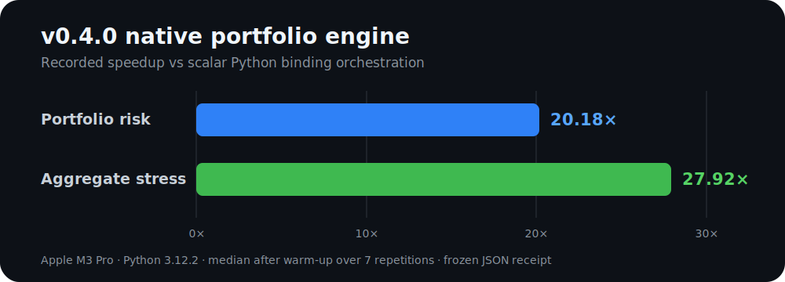
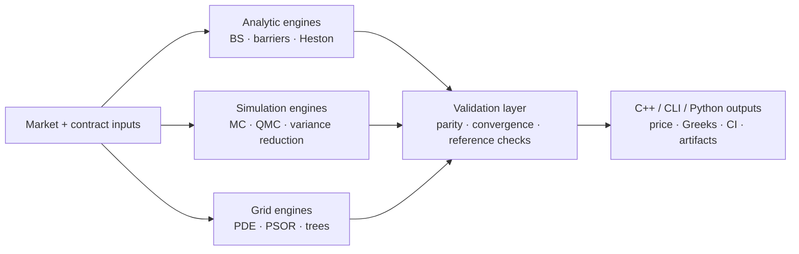

# quant-pricer-cpp

[](https://github.com/MateoBodon/quant-pricer-cpp/releases/latest)
[](https://mateobodon.github.io/quant-pricer-cpp/)
[](LICENSE)

**Portfolio risk and exact stress in C++20 and Python—backed by independent,
artifact-bound numerical evidence.**

v0.4.0 adds native vectorized valuation, six quantity-weighted portfolio
measures, and exact five-factor scenario P&L through `bs_portfolio_risk` and
`bs_portfolio_scenarios`. The broader library retains analytic, Monte Carlo,
QMC, PDE, Heston, SSVI, exotic-option, and reproducibility surfaces.

> **Release status — v0.4.0.** Build from source or use the signed-off GitHub
> release assets. `pyquant-pricer` is **not published on PyPI**. Benchmark and
> accuracy numbers below are dated snapshots bound to their artifacts and
> hardware—not universal guarantees.

| v0.4.0 proof | Result | Evidence boundary |
| --- | ---: | --- |
| Portfolio risk batch | **`20.18×`**; `20.25M` positions/s | 100,000 positions; Apple M3 Pro; 7-run median |
| Exact aggregate stress | **`27.92×`**; `32.13M` cells/s | 20,000 positions × 16 shocks; same host/protocol |
| Independent QuantLib parity | price `3.91e-14`; Greek `3.40e-12`; portfolio P&L `2.66e-13` | 60 mixed positions and 72 scenario cells |
| Determinism | zero-shock exactly zero; **32/32** concurrent replays identical | Frozen installed-wheel evaluator |

<p align="center">
  
</p>

These are deterministic Black–Scholes European valuation and user-supplied
stress results—not trading alpha, forecasting, probabilistic market-risk
validation, or live P&L. [Read the exact contract and receipts.](docs/product/DERIVATIVES_SYSTEM_HUB.md)

The established evidence remains available: `4.76×` median QMC/PRNG RMSE ratio
on the frozen equal-time cases, `-2.012` PDE convergence slope, `12.75M`
one-thread MC paths/s on the recorded EPYC host, and the exact 12-date SSVI
confirmation with its retained loss and no-trading boundary.

## At a glance

| Area | Coverage |
| --- | --- |
| Portfolio risk / stress | Vectorized mixed call/put valuation; value, delta, gamma, vega, theta, rho totals; exact five-factor scenario P&L |
| Analytic | Black–Scholes prices/Greeks/implied vol, digitals, Reiner–Rubinstein barriers, Heston European calls |
| Monte Carlo / QMC | Deterministic counter RNG, OpenMP, antithetic/control variates, Sobol + Brownian bridge, confidence intervals |
| PDE / early exercise | Crank–Nicolson + Rannacher, stretched grids, PSOR, CRR tree, Longstaff–Schwartz |
| Exotics / models | Asian, lookback, barrier, basket, Merton jump-diffusion, Heston Euler/QE |
| Risk statistics | VaR/CVaR, Student-t variants, Kupiec/Christoffersen backtests |
| Interfaces | C++ library and CLI, CMake package, pybind11 module, GitHub release wheels |

## Portfolio risk in 60 seconds

Build from source with `python -m pip install .`, or download the wheel matching
your Python and platform from the [v0.4.0 GitHub release](https://github.com/MateoBodon/quant-pricer-cpp/releases/tag/v0.4.0).

```python
import numpy as np
import pyquant_pricer as qp

# option type, quantity, spot, strike, rate, dividend, volatility, time
positions = np.array([
    [ 1, 120, 100,  95, .03, .01, .22,  90/365],
    [-1, -80, 100, 105, .03, .01, .25,  90/365],
    [ 1,  50, 100, 110, .03, .01, .28, 180/365],
], dtype=np.float64)

risk = qp.bs_portfolio_risk(positions)
totals = dict(zip(risk["total_columns"], risk["portfolio_totals"]))

# spot return, absolute vol/rate/dividend shifts, elapsed years
shocks = np.array([[0, 0, 0, 0, 0], [-.10, .08, .01, 0, 1/365]])
stress = qp.bs_portfolio_scenarios(positions, shocks, detail=False)
print(totals)
print(stress["portfolio_pnl"])
```

`detail=False` avoids allocating the scenario-by-position attribution matrix.
For validation rules, units, C++ types, and limitations, use the
[product hub](docs/product/DERIVATIVES_SYSTEM_HUB.md) and the runnable
[`portfolio_risk.py`](python/examples/portfolio_risk.py) example.

## Build and scalar pricing

### C++

```bash
git clone --recurse-submodules https://github.com/MateoBodon/quant-pricer-cpp.git
cd quant-pricer-cpp
cmake -S . -B build -DCMAKE_BUILD_TYPE=Release
cmake --build build -j
ctest --test-dir build -L FAST --output-on-failure
```

```cpp
#include <iostream>
#include <quant/black_scholes.hpp>

int main() {
    const double call = quant::bs::call_price(
        100.0, 105.0, 0.02, 0.01, 0.25, 0.5
    );
    const double delta = quant::bs::delta_call(
        100.0, 105.0, 0.02, 0.01, 0.25, 0.5
    );
    std::cout << "call=" << call << " delta=" << delta << '\n';
}
```

Install the CMake package for a downstream project:

```bash
cmake --install build --prefix "$PWD/install"
```

```cmake
find_package(quant-pricer CONFIG REQUIRED)
target_link_libraries(my_app PRIVATE quant_pricer)
```

### Python (source build)

```bash
python -m venv .venv
source .venv/bin/activate
python -m pip install --upgrade pip
python -m pip install .
```

The original v0.4.0 evaluator verified the wheel build/install/import path on
Python 3.12 macOS arm64 at source commit `60c4e9da`; its exact wheel SHA-256 is
`bfc005727c385f8c7978e670cc0de6295f7540746040dbd1c92771602a6760d1`.
The public release's `release-manifest.json` separately binds every supported
platform wheel and the sdist to the tag commit. PyPI is not claimed; the source
build above remains the portable fallback.

```python
import pyquant_pricer as qp

call = qp.bs_call(100.0, 105.0, 0.02, 0.01, 0.25, 0.5)
delta = qp.bs_delta_call(100.0, 105.0, 0.02, 0.01, 0.25, 0.5)

params = qp.McParams()
params.spot = 100.0
params.strike = 105.0
params.rate = 0.02
params.vol = 0.25
params.time = 0.5
params.num_paths = 200_000
params.seed = 7
mc = qp.mc_european_call(params)

print(f"BS={call:.4f} delta={delta:.4f}")
print(f"MC={mc.estimate.value:.4f} ± {1.96 * mc.estimate.std_error:.4f}")
```

See [`python/examples/quickstart.py`](python/examples/quickstart.py) for a fuller
walkthrough, including barriers and Heston helpers.

### Vectorized analytic Heston calls

`heston_calls_analytic_batch` accepts two contiguous `float64` matrices. Market
columns are `(spot, strike, rate, dividend, time)`; parameter columns are
`(kappa, theta, sigma, rho, v0)`.

```python
import numpy as np
import pyquant_pricer as qp

markets = np.array([
    [100.0, 90.0, 0.015, 0.005, 0.5],
    [100.0, 100.0, 0.015, 0.005, 1.0],
    [100.0, 110.0, 0.015, 0.005, 2.0],
])
params = np.array([[1.5, 0.04, 0.6, -0.45, 0.04]])
call_prices = qp.heston_calls_analytic_batch(markets, params)
put_prices = qp.heston_puts_analytic_batch(markets, params)
implied_vols = qp.heston_implied_vols_batch(markets, params)
call_metrics = qp.heston_call_metrics_batch(markets, params)
candidate_grid = qp.heston_call_metrics_grid(markets, params)
print(call_prices, put_prices, implied_vols, call_metrics, candidate_grid)
```

Inputs must have nonzero row counts and valid finite Heston values. Supply one parameter row
to broadcast a calibration across every market, one market row to evaluate many parameter
candidates, or matching row counts for pairwise evaluation. Every other row-count mismatch is
rejected. The
runtime uses one worker per 32 rows, capped by a process-wide four-worker budget
shared across concurrent callers. Inspect the fixed policy with
`qp.heston_analytic_batch_policy()`. `heston_implied_vols_batch` applies the
same contract and returns the Black-Scholes implied volatility of each analytic
Heston call.

When both values are needed, `heston_call_metrics_batch` returns contiguous
`(call_price, implied_vol)` columns while evaluating the analytic Heston call
only once per market row.

For calibration sweeps, `heston_call_metrics_grid(markets, params)` evaluates
every parameter candidate against every market row without expanded Cartesian
inputs. Its contiguous `(p, m, 2)` output is candidate-major, with final-axis
columns `(call_price, implied_vol)`.

---

## Validation Pack

The repo can generate a `validation_pack.zip` containing committed CSV/PNG/JSON artifacts plus `docs/artifacts/manifest.json`, so reviewers can diff published numbers without rebuilding. The T-001/T-101 evidence pass did not verify current release-asset availability; regenerate locally with:

```bash
WRDS_USE_SAMPLE=1 ./scripts/reproduce_all.sh
python scripts/package_validation.py --artifacts docs/artifacts --output docs/validation_pack.zip
```

Upload the resulting `docs/validation_pack.zip` when drafting a GitHub release to keep reproducible evidence alongside the tag.

---

## Results at a Glance

Curated figures (plus precise reproduction commands) live on the [Results page](https://mateobodon.github.io/quant-pricer-cpp/Results.html).

- **Metrics snapshot (latest committed artifact snapshot):**
  - Generate: `WRDS_USE_SAMPLE=1 ./scripts/reproduce_all.sh && python scripts/generate_metrics_summary.py --artifacts docs/artifacts --manifest docs/artifacts/manifest.json`
  - Browse: `docs/artifacts/metrics_summary.md` (artifact-derived; current committed snapshot is historical until current-HEAD reproduction is repaired)

- **Real-data SSVI temporal confirmation:** On a published, one-use 12-pair
  2020–2025 OptionMetrics panel, arbitrage-aware SSVI passed every
  analytic/numerical/finite/QuantLib gate and won next-day price MAE on 11/12
  dates versus repaired Heston and 12/12 versus tenor-flat Black–Scholes.
  Median relative changes were `-8.88%` and `-79.90%`, respectively. This is an
  exact-panel, SSVI-unseen but not dataset-blind result; hedge behavior and
  future returns were not tested. Machine-readable aggregate evidence:
  [`ssvi_temporal_holdout_v1_summary.json`](docs/artifacts/ssvi_temporal_holdout_v1_summary.json).

- **Native C++ power-law SSVI:** The confirmed formulation now has a typed C++20
  surface/calibration API, analytic total-variance derivatives, call/put
  pricing, sticky-strike smile delta/gamma, local vega, deterministic
  three-start calibration, dense arbitrage tests, and Python/QuantLib oracle
  parity. On the recorded Mac15,6 Release benchmark, median price+risk latency
  was `116 ns`, a 1,024-node batch ran at `7.16M nodes/s`, and a 65-point
  three-start calibration took `1.336 ms`. These numbers are hardware/protocol
  specific. API: [`include/quant/ssvi.hpp`](include/quant/ssvi.hpp); benchmark:
  [`ssvi_cpp_benchmark_v1.json`](docs/artifacts/ssvi_cpp_benchmark_v1.json).

- <a href="https://mateobodon.github.io/quant-pricer-cpp/Results.html#tri-engine-agreement"></a><br>
  **Tri-Engine Agreement (BS / MC / PDE)** – Analytic, deterministic MC, and Crank–Nicolson agree to <5 bps across strikes; MC CI is shown.<br>
  Reproduce: `python scripts/tri_engine_agreement.py --quant-cli build/quant_cli --output docs/artifacts/tri_engine_agreement.png --csv docs/artifacts/tri_engine_agreement.csv`
  Data: [tri_engine_agreement.csv](https://mateobodon.github.io/quant-pricer-cpp/artifacts/tri_engine_agreement.csv)
- <a href="https://mateobodon.github.io/quant-pricer-cpp/Results.html#qmc-vs-prng-equal-wall-clock"></a><br>
  **QMC vs PRNG (equal wall-clock)** – In the committed artifact snapshot, the median PRNG/QMC RMSE ratio is 4.76346 for the tested European + Asian scenarios; this is scenario/protocol-specific, not a universal QMC claim.<br>
  Reproduce: `python scripts/qmc_vs_prng_equal_time.py --output docs/artifacts/qmc_vs_prng_equal_time.png --csv docs/artifacts/qmc_vs_prng_equal_time.csv --fast`
  Data: [qmc_vs_prng_equal_time.csv](https://mateobodon.github.io/quant-pricer-cpp/artifacts/qmc_vs_prng_equal_time.csv)
- <a href="https://mateobodon.github.io/quant-pricer-cpp/Results.html#wrds-heston"></a><br>
  **WRDS Heston (multi-date Vega + Δ-hedge)** – Aggregated deterministic sample/regression bundle with vega×quote-weighted IV/OOS errors (DTE ≥21d, 0.75–1.25 wings with soft taper) and Δ-hedged 1d buckets; snapshot values live in `docs/artifacts/metrics_summary.md`. Live/local WRDS evidence is gated and is not promoted by the sample bundle.<br>
  Reproduce (sample): `python wrds_pipeline/pipeline.py --dateset wrds_pipeline_dates_panel.yaml --use-sample`
  Data: [wrds_agg_pricing.csv](https://mateobodon.github.io/quant-pricer-cpp/artifacts/wrds_agg_pricing.csv), [wrds_agg_oos.csv](https://mateobodon.github.io/quant-pricer-cpp/artifacts/wrds_agg_oos.csv), [wrds_agg_pnl.csv](https://mateobodon.github.io/quant-pricer-cpp/artifacts/wrds_agg_pnl.csv)
- <a href="https://mateobodon.github.io/quant-pricer-cpp/Results.html#wrds-heston"></a><br>
  **WRDS BS vs Heston (sample comparison)** – On the bundled sample dates Heston and BS are now near parity (per-tenor IV RMSE deltas within ±0.0002 vol pts; OOS deltas single-digit bps). Live IvyDB pulls remain the source of truth; sample bundle is a smoke test/regression harness.<br>
  
  | Tenor | BS IV RMSE | Heston IV RMSE | OOS IV MAE BS (bps) | OOS IV MAE Heston (bps) | Δ‑hedged σ (Heston, ticks) |
  | --- | --- | --- | --- | --- | --- |
  | 30d | 0.0237 | 0.0237 | 166.9 | 167.4 | 96.1 |
  | 60d | 0.0157 | 0.0158 | 122.5 | 121.1 | 64.2 |
  | 90d | 0.0146 | 0.0146 | 126.3 | 128.8 | 47.0 |
  
  See `docs/WRDS_Results.md` for narrative, heatmaps, and the tracked `docs/artifacts/wrds/wrds_bs_heston_comparison.csv`.
- <a href="https://mateobodon.github.io/quant-pricer-cpp/Results.html#quantlib-parity"></a><br>
  **QuantLib Parity (vanilla/barrier/American)** – quant-pricer-cpp prices match QuantLib within ≈1¢ while exposing runtime deltas for each product.<br>
  Reproduce: `python scripts/ql_parity.py --output docs/artifacts/ql_parity/ql_parity.png --csv docs/artifacts/ql_parity/ql_parity.csv`
  Data: [ql_parity.csv](https://mateobodon.github.io/quant-pricer-cpp/artifacts/ql_parity/ql_parity.csv)

---

## Table of Contents

- [Features](#features)
- [Architecture](#architecture)
- [Numerical Methods](#numerical-methods)
- [Variance Reduction & Greeks](#variance-reduction--greeks)
- [Determinism & Reproducibility](#determinism--reproducibility)
- [Build & Install](#build--install)
- [CLI Usage](#cli-usage)
- [Library API Overview](#library-api-overview)
- [Validation & Results](#validation--results)
- [Benchmarks](#benchmarks)
- [Testing & CI](#testing--ci)
- [Docs](#docs)
- [Limitations](#limitations)
- [Roadmap](#roadmap)
- [License](#license)

---

## Features

### 🚀 **Core Pricing Engines**
- **Black–Scholes Analytics**: Complete European option pricing with all major Greeks (Delta, Gamma, Vega, Theta, Rho)
- **Monte Carlo Engine**: High-performance GBM simulation with deterministic counter-based RNG (thread-invariant), optional PCG/MT streams, and OpenMP parallelization
- **PDE Solver**: Crank–Nicolson with Rannacher start-up, optional tanh-stretched grids around the strike, and direct Δ/Γ/Θ extraction
- **Barrier Options**: Continuous single-barrier (up/down, in/out) pricing via Reiner–Rubinstein closed-form, Brownian-bridge Monte Carlo, and absorbing-boundary PDE
- **American Options**: PSOR (finite-difference LCP) and Longstaff–Schwartz Monte Carlo with polynomial basis, covered by FAST consistency checks.
- **Exotics**: Arithmetic Asian MC with geometric CV, lookback MC (fixed/floating), digitals (analytic and MC hooks)
- **Heston**: Analytic European call via characteristic-function Gauss–Laguerre **plus Andersen QE Monte Carlo** with deterministic counter-based RNG for variance paths
- **Portfolio Risk & Stress**: vectorized mixed call/put valuation, quantity-weighted price/Greek aggregation, and exact multi-factor scenario P&L with allocation-safe aggregate-only mode
- **Risk Statistics**: VaR/CVaR via MC and historical backtesting with Kupiec and Christoffersen tests
 - **Multi‑Asset & Jumps**: Basket MC with Cholesky correlation; Merton jump‑diffusion MC for European options

### ⚡ **Advanced Monte Carlo**
- **Variance Reduction**: Antithetic variates and control variates for improved convergence
- **Quasi-Monte Carlo**: **Sobol** (optional Owen/digital shift) **+ Brownian bridge** path construction; antithetic and control variates. *Legacy:* an earlier version used a Van der Corput scalar sequence with inverse-normal transform for single-step paths.
- **MC Greeks**: Pathwise estimators (Delta, Vega) and Likelihood Ratio Method (Gamma)
- **Streaming Architecture**: Cache-friendly memory access patterns for optimal performance
- **Piecewise-Constant Schedules**: Optional rate/dividend/vol term structures for vanilla and barrier engines via CSV or `PiecewiseConstant`

### 🎯 **Production-Ready Quality**
- **Cross-Validation**: Three independent pricing methods for result verification
- **Comprehensive Testing**: Unit tests, edge cases, put-call parity, and convergence validation
- **Performance Benchmarks**: Google Benchmark integration with detailed timing analysis
- **Modern C++20**: Clean, type-safe API with constexpr optimizations

### 🔧 **Developer Experience**
- **CLI Interface**: Command-line tool for interactive pricing and parameter exploration
- **CMake Build System**: Cross-platform support with optional dependencies
- **CI/CD Pipeline**: Multi-compiler, multi-OS testing with sanitizers and static analysis
- **Documentation**: Doxygen-generated API docs with mathematical formulations
- **Python Bindings**: Optional `pyquant_pricer` module (pybind11) with BS portfolio risk/stress plus MC/PDE/Heston coverage, enums (`OptionType`, `BarrierType`, `McSampler`, `McBridge`), and `PiecewiseConstant` schedules; wheels via cibuildwheel

---

## Architecture


```mermaid
flowchart LR
    I["Market + contract inputs"] --> A["Analytic engines<br/>BS · barriers · Heston"]
    I --> M["Simulation engines<br/>MC · QMC · variance reduction"]
    I --> P["Grid engines<br/>PDE · PSOR · trees"]
    A --> V["Validation layer<br/>parity · convergence · reference checks"]
    M --> V
    P --> V
    V --> O["C++ / CLI / Python outputs<br/>price · Greeks · CI · artifacts"]
```

Independent engines are a design feature: analytic prices provide references,
Monte Carlo exposes statistical uncertainty, PDE/tree methods cover contracts
where closed forms do not, and artifact scripts turn comparisons into inspectable
CSV/PNG evidence.

## Validated numerical snapshot

The current default-branch metrics snapshot was generated on **2026-01-25** from
the committed synthetic/sample validation protocol.

| Check | Artifact-bound result | Context |
| --- | ---: | --- |
| Monte Carlo vs Black–Scholes | max absolute error `0.00755` | 4-point tri-engine grid; BS covered by MC confidence intervals |
| PDE vs Black–Scholes | max absolute error `0.000587` | same grid |
| PDE convergence | slope `-2.012`, R² `0.999997` | finest grid 401 nodes × 400 steps |
| QuantLib parity | max difference `0.862¢` | vanilla, barrier, and American sample cases |
| QMC vs PRNG | median RMSE ratio `4.76×` | equal-time European + Asian benchmark |
| MC throughput | `12.75M` paths/s, 1 thread | AMD EPYC 9454P, Linux, 96 logical CPUs; historical benchmark |


*Tri-engine agreement across the frozen validation grid.*


*QMC versus PRNG at equal wall time.*

Sources: [`metrics_summary.md`](docs/artifacts/metrics_summary.md),
[`manifest.json`](docs/artifacts/manifest.json), and the underlying
[CSV/PNG artifacts](docs/artifacts/README.md). Regenerate the synthetic pack with:

```bash
WRDS_USE_SAMPLE=1 ./scripts/reproduce_all.sh
python scripts/package_validation.py \
  --artifacts docs/artifacts \
  --output docs/validation_pack.zip
```

`WRDS_USE_SAMPLE=1` is a regression harness. It does not establish live-market
fit or trading performance.

## Heston

The public v0.4.0 surface includes analytic European calls and puts,
characteristic functions, implied-volatility helpers, bounded batch/grid
interfaces, and Euler/QE Monte Carlo:

```python
params = qp.HestonParams()
params.kappa, params.theta = 1.5, 0.04
params.sigma, params.rho, params.v0 = 0.5, -0.5, 0.04

market = qp.HestonMarket()
market.spot, market.strike = 100.0, 100.0
market.rate, market.dividend, market.time = 0.01, 0.0, 1.0

price = qp.heston_call_analytic(market, params)
iv = qp.heston_implied_vol(market, params)
```

### Vectorized Heston analytics

The batch APIs accept market columns `(spot, strike, rate, dividend, time)` and
parameter columns `(kappa, theta, sigma, rho, v0)`. Inputs may provide one parameter row
for broadcasting or one row per market. Execution uses a
process-wide four-worker budget; inspect the fixed policy with
`qp.heston_analytic_batch_policy()`.

```python
import numpy as np

markets = np.array([
    [100.0, 90.0, 0.015, 0.005, 0.5],
    [100.0, 110.0, 0.015, 0.005, 2.0],
])
params = np.array([[1.5, 0.04, 0.6, -0.45, 0.04]])

calls = qp.heston_calls_analytic_batch(markets, params)
puts = qp.heston_puts_analytic_batch(markets, params)
metrics = qp.heston_call_metrics_grid(markets, params)
```

`heston_call_metrics_grid` produces a contiguous candidate-major `(p,m,2)`
array of call price and implied volatility. Its installed-wheel evaluator proved
exact cell-by-cell equivalence to the batch API, pre-allocation overflow
rejection, deterministic eight-way concurrency under the shared worker cap, and
**14.2× lower input materialization** than an explicit Cartesian input.

That `14.2×` figure measures compact input representation for the frozen test
case—not pricing speed or calibration quality. Exact commit, wheel digest,
verification receipt, and claim limits are in the
[verification note](docs/evidence/heston_grid_candidate_2026-07-14.md).

## Method map

| Contract / output | Analytic | Monte Carlo / QMC | PDE / tree |
| --- | :---: | :---: | :---: |
| European vanilla + Greeks | ✓ | ✓ | ✓ |
| Single barrier | ✓ | ✓ | ✓ |
| American | — | LSMC | CRR + PSOR |
| Asian / lookback | — | ✓ | — |
| Heston European call | ✓ | Euler + QE | — |
| Basket / Merton jump | — | ✓ | — |
| VaR / CVaR | parametric helpers | simulation | — |

## Determinism and uncertainty

The default Monte Carlo RNG hashes `(seed, path, step, dimension)`, so changing
OpenMP scheduling does not change the stream assigned to a path. Estimates carry
standard error and 95% confidence bounds. Stateful MT/PCG-style modes remain
available when a conventional stream is preferred.

```cpp
quant::mc::McParams p{
    .spot = 100.0,
    .strike = 100.0,
    .rate = 0.03,
    .dividend = 0.0,
    .vol = 0.2,
    .time = 1.0,
    .num_paths = 1'000'000,
    .seed = 42,
    .antithetic = true,
    .control_variate = true,
    .qmc = quant::mc::McParams::Qmc::Sobol,
    .bridge = quant::mc::McParams::Bridge::BrownianBridge,
    .num_steps = 64
};

auto result = quant::mc::price_european_call(p);
// result.estimate.value, std_error, ci_low, ci_high
```

## CLI examples

```bash
# Analytic vanilla
./build/quant_cli bs 100 105 0.02 0.01 0.25 0.5 call

# Deterministic Monte Carlo
./build/quant_cli mc 100 105 0.02 0.01 0.25 0.5 \
  1000000 42 1 none none 1 --rng=counter --ci --json

# Crank–Nicolson PDE
./build/quant_cli pde 100 105 0.02 0.01 0.25 0.5 \
  call 201 200 4.0 1 1 2.5 1 1 --json
```

Run `./build/quant_cli --help` for the engine list and parameter details.

## Repository map

| Path | Role |
| --- | --- |
| `include/quant/`, `src/` | Public C++ APIs and implementations |
| `python/` | pybind11 module, examples, and wheel smoke tests |
| `tests/` | C++ and Python FAST/MARKET validation |
| `benchmarks/` | Google Benchmark harnesses |
| `docs/artifacts/` | Curated CSV/PNG evidence and manifest |
| `wrds_pipeline/` | Sample/live-gated OptionMetrics research pipeline |
| `scripts/` | Reproduction, parity, benchmark, and packaging tools |

## Validation commands

```bash
# Fast deterministic suite
ctest --test-dir build -L FAST --output-on-failure

# Python/source policy checks
python scripts/check_data_policy.py
python -m pytest -q tests -m 'not market'

# Sanitizers in a separate build
cmake -S . -B build-asan \
  -DCMAKE_BUILD_TYPE=Debug \
  -DQUANT_ENABLE_SANITIZERS=ON
cmake --build build-asan -j
ctest --test-dir build-asan --output-on-failure
```

## Limitations and evidence status

- **Heston QE is experimental.** The committed QE-vs-analytic artifact shows
  known bias; analytic Heston, not QE, is used in the sample WRDS fit path.
- **Sample WRDS artifacts are regression evidence.** They are not a live-data
  superiority, hedge-PnL, or trading claim.
- **Heston is not shown to dominate Black–Scholes.** The bundled comparison is
  near parity/mixed by tenor, and older hedge labeling is not a valid
  Heston-specific hedge claim.
- **SSVI evidence is bounded.** The public C++ surface and exact frozen panels
  support their documented pricing, calibration, and fit claims. No SSVI hedge,
  P&L, return, trading, or universal-superiority claim is made.
- **Artifact freshness matters.** The headline snapshot is dated 2026-01-25.
  Re-run the reproduction pack before using it as current-machine evidence.
- **Package availability is explicit.** PyPI returned no `pyquant-pricer`
  distribution on 2026-07-14. Use the source build or the platform wheels
  attached to the verified GitHub release.

## Releases, contribution, and citation

The latest public release is [v0.4.0](https://github.com/MateoBodon/quant-pricer-cpp/releases/tag/v0.4.0),
with source/wheel assets, a deterministic release manifest, and a validation
pack. See
[`CONTRIBUTING.md`](CONTRIBUTING.md) for focused changes and
[`CITATION.cff`](CITATION.cff) for citation metadata.

## License

[MIT](LICENSE). Market-data providers may impose separate restrictions; raw
WRDS/OptionMetrics data are not distributed.
