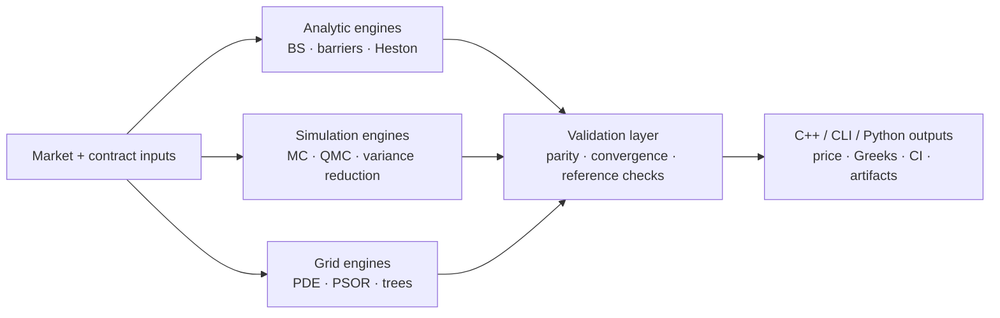
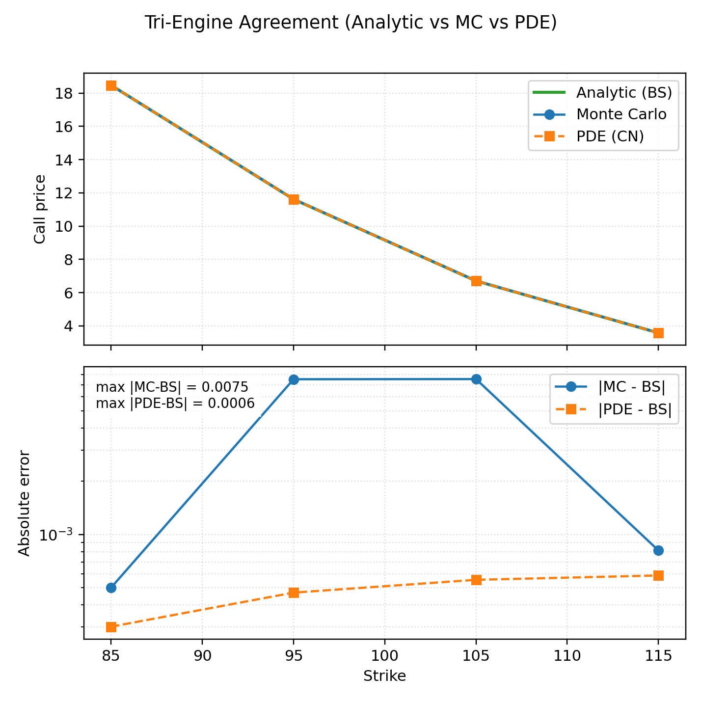
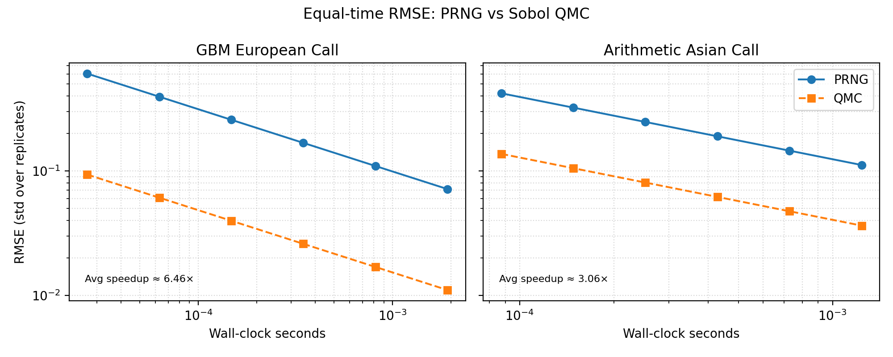

# quant-pricer-cpp

[](https://github.com/MateoBodon/quant-pricer-cpp/releases/latest)
[](https://mateobodon.github.io/quant-pricer-cpp/)
[](LICENSE)

**A modern C++20 option-pricing library with Python bindings and reproducible
numerical evidence across analytic, Monte Carlo, PDE, and reference engines.**

Use it to price vanilla and exotic options, estimate Greeks with uncertainty,
cross-check independent methods, and carry the exact validation artifacts with
the result.

> **Release status — v0.3.2.** Build from source or use the release source
> archive. `pyquant-pricer` is **not currently published on PyPI**; the latest
> release attaches a manifest and validation pack, not wheels. Benchmark and
> accuracy numbers below are historical snapshots bound to their artifacts and
> hardware—not universal guarantees.

## At a glance

| Area | Coverage |
| --- | --- |
| Analytic | Black–Scholes prices/Greeks/implied vol, digitals, Reiner–Rubinstein barriers, Heston European calls |
| Monte Carlo / QMC | Deterministic counter RNG, OpenMP, antithetic/control variates, Sobol + Brownian bridge, confidence intervals |
| PDE / early exercise | Crank–Nicolson + Rannacher, stretched grids, PSOR, CRR tree, Longstaff–Schwartz |
| Exotics / models | Asian, lookback, barrier, basket, Merton jump-diffusion, Heston Euler/QE |
| Risk | VaR/CVaR, Student-t variants, Kupiec/Christoffersen backtests |
| Interfaces | C++ library and CLI, CMake package, optional pybind11 module |

## First price

### C++

```bash
git clone --recurse-submodules https://github.com/MateoBodon/quant-pricer-cpp.git
cd quant-pricer-cpp
cmake -S . -B build -DCMAKE_BUILD_TYPE=Release
cmake --build build -j
ctest --test-dir build -L FAST --output-on-failure
```

```cpp
#include <iostream>
#include <quant/black_scholes.hpp>

int main() {
    const double call = quant::bs::call_price(
        100.0, 105.0, 0.02, 0.01, 0.25, 0.5
    );
    const double delta = quant::bs::delta_call(
        100.0, 105.0, 0.02, 0.01, 0.25, 0.5
    );
    std::cout << "call=" << call << " delta=" << delta << '\n';
}
```

Install the CMake package for a downstream project:

```bash
cmake --install build --prefix "$PWD/install"
```

```cmake
find_package(quant-pricer CONFIG REQUIRED)
target_link_libraries(my_app PRIVATE quant_pricer)
```

### Python (source build)

```bash
python -m venv .venv
source .venv/bin/activate
python -m pip install --upgrade pip
python -m pip install .
```

```python
import pyquant_pricer as qp

call = qp.bs_call(100.0, 105.0, 0.02, 0.01, 0.25, 0.5)
delta = qp.bs_delta_call(100.0, 105.0, 0.02, 0.01, 0.25, 0.5)

params = qp.McParams()
params.spot = 100.0
params.strike = 105.0
params.rate = 0.02
params.vol = 0.25
params.time = 0.5
params.num_paths = 200_000
params.seed = 7
mc = qp.mc_european_call(params)

print(f"BS={call:.4f} delta={delta:.4f}")
print(f"MC={mc.estimate.value:.4f} ± {1.96 * mc.estimate.std_error:.4f}")
```

See [`python/examples/quickstart.py`](python/examples/quickstart.py) for barriers
and Heston helpers.

## Architecture


```mermaid
flowchart LR
    I["Market + contract inputs"] --> A["Analytic engines<br/>BS · barriers · Heston"]
    I --> M["Simulation engines<br/>MC · QMC · variance reduction"]
    I --> P["Grid engines<br/>PDE · PSOR · trees"]
    A --> V["Validation layer<br/>parity · convergence · reference checks"]
    M --> V
    P --> V
    V --> O["C++ / CLI / Python outputs<br/>price · Greeks · CI · artifacts"]
```

Independent engines are a design feature: analytic prices provide references,
Monte Carlo exposes statistical uncertainty, PDE/tree methods cover contracts
where closed forms do not, and artifact scripts turn comparisons into inspectable
CSV/PNG evidence.

## Validated numerical snapshot

The current default-branch metrics snapshot was generated on **2026-01-25** from
the committed synthetic/sample validation protocol.

| Check | Artifact-bound result | Context |
| --- | ---: | --- |
| Monte Carlo vs Black–Scholes | max absolute error `0.00755` | 4-point tri-engine grid; BS covered by MC confidence intervals |
| PDE vs Black–Scholes | max absolute error `0.000587` | same grid |
| PDE convergence | slope `-2.012`, R² `0.999997` | finest grid 401 nodes × 400 steps |
| QuantLib parity | max difference `0.862¢` | vanilla, barrier, and American sample cases |
| QMC vs PRNG | median RMSE ratio `4.76×` | equal-time European + Asian benchmark |
| MC throughput | `12.75M` paths/s, 1 thread | AMD EPYC 9454P, Linux, 96 logical CPUs; historical benchmark |

<table>
  <tr>
    <td width="50%"></td>
    <td width="50%"></td>
  </tr>
  <tr>
    <td align="center">Tri-engine agreement</td>
    <td align="center">QMC vs PRNG at equal wall time</td>
  </tr>
</table>

Sources: [`metrics_summary.md`](docs/artifacts/metrics_summary.md),
[`manifest.json`](docs/artifacts/manifest.json), and the underlying
[CSV/PNG artifacts](docs/artifacts/README.md). Regenerate the synthetic pack with:

```bash
WRDS_USE_SAMPLE=1 ./scripts/reproduce_all.sh
python scripts/package_validation.py \
  --artifacts docs/artifacts \
  --output docs/validation_pack.zip
```

`WRDS_USE_SAMPLE=1` is a regression harness. It does not establish live-market
fit or trading performance.

## Heston

The public v0.3.2 surface includes analytic European calls, characteristic
functions, implied-volatility helpers, and Euler/QE Monte Carlo:

```python
params = qp.HestonParams()
params.kappa, params.theta = 1.5, 0.04
params.sigma, params.rho, params.v0 = 0.5, -0.5, 0.04

market = qp.HestonMarket()
market.spot, market.strike = 100.0, 100.0
market.rate, market.dividend, market.time = 0.01, 0.0, 1.0

price = qp.heston_call_analytic(market, params)
iv = qp.heston_implied_vol(market, params)
```

### Validated next-release candidate

A newer, **not-yet-released and not-on-v0.3.2** Python binding candidate adds
`heston_call_metrics_grid`: compact market `(m,5)` and parameter `(p,5)` inputs
produce a contiguous candidate-major `(p,m,2)` array of call price and implied
volatility. Its installed-wheel evaluator proved exact cell-by-cell equivalence
to the batch API, pre-allocation overflow rejection, deterministic eight-way
concurrency under a shared four-worker cap, and **14.2× lower input
materialization** than an explicit Cartesian input.

That `14.2×` figure measures compact input representation for the frozen test
case—not pricing speed or calibration quality. Exact commit, wheel digest,
verification receipt, and claim limits are in the
[candidate evidence note](docs/evidence/heston_grid_candidate_2026-07-14.md).

## Method map

| Contract / output | Analytic | Monte Carlo / QMC | PDE / tree |
| --- | :---: | :---: | :---: |
| European vanilla + Greeks | ✓ | ✓ | ✓ |
| Single barrier | ✓ | ✓ | ✓ |
| American | — | LSMC | CRR + PSOR |
| Asian / lookback | — | ✓ | — |
| Heston European call | ✓ | Euler + QE | — |
| Basket / Merton jump | — | ✓ | — |
| VaR / CVaR | parametric helpers | simulation | — |

## Determinism and uncertainty

The default Monte Carlo RNG hashes `(seed, path, step, dimension)`, so changing
OpenMP scheduling does not change the stream assigned to a path. Estimates carry
standard error and 95% confidence bounds. Stateful MT/PCG-style modes remain
available when a conventional stream is preferred.

```cpp
quant::mc::McParams p{
    .spot = 100.0,
    .strike = 100.0,
    .rate = 0.03,
    .dividend = 0.0,
    .vol = 0.2,
    .time = 1.0,
    .num_paths = 1'000'000,
    .seed = 42,
    .antithetic = true,
    .control_variate = true,
    .qmc = quant::mc::McParams::Qmc::Sobol,
    .bridge = quant::mc::McParams::Bridge::BrownianBridge,
    .num_steps = 64
};

auto result = quant::mc::price_european_call(p);
// result.estimate.value, std_error, ci_low, ci_high
```

## CLI examples

```bash
# Analytic vanilla
./build/quant_cli bs 100 105 0.02 0.01 0.25 0.5 call

# Deterministic Monte Carlo
./build/quant_cli mc 100 105 0.02 0.01 0.25 0.5 \
  1000000 42 1 none none 1 --rng=counter --ci --json

# Crank–Nicolson PDE
./build/quant_cli pde 100 105 0.02 0.01 0.25 0.5 \
  call 201 200 4.0 1 1 2.5 1 1 --json
```

Run `./build/quant_cli --help` for the engine list and parameter details.

## Repository map

| Path | Role |
| --- | --- |
| `include/quant/`, `src/` | Public C++ APIs and implementations |
| `python/` | pybind11 module, examples, and wheel smoke tests |
| `tests/` | C++ and Python FAST/MARKET validation |
| `benchmarks/` | Google Benchmark harnesses |
| `docs/artifacts/` | Curated CSV/PNG evidence and manifest |
| `wrds_pipeline/` | Sample/live-gated OptionMetrics research pipeline |
| `scripts/` | Reproduction, parity, benchmark, and packaging tools |

## Validation commands

```bash
# Fast deterministic suite
ctest --test-dir build -L FAST --output-on-failure

# Python/source policy checks
python scripts/check_data_policy.py
python -m pytest -q tests -m 'not market'

# Sanitizers in a separate build
cmake -S . -B build-asan \
  -DCMAKE_BUILD_TYPE=Debug \
  -DQUANT_ENABLE_SANITIZERS=ON
cmake --build build-asan -j
ctest --test-dir build-asan --output-on-failure
```

## Limitations and evidence status

- **Heston QE is experimental.** The committed QE-vs-analytic artifact shows
  known bias; analytic Heston, not QE, is used in the sample WRDS fit path.
- **Sample WRDS artifacts are regression evidence.** They are not a live-data
  superiority, hedge-PnL, or trading claim.
- **Heston is not shown to dominate Black–Scholes.** The bundled comparison is
  near parity/mixed by tenor, and older hedge labeling is not a valid
  Heston-specific hedge claim.
- **SSVI is not a v0.3.2 public API.** Newer research exists outside this public
  release, but is intentionally excluded here until its release/evidence path is
  coherent. No SSVI hedge, PnL, or universal-superiority claim is made.
- **Artifact freshness matters.** The headline snapshot is dated 2026-01-25.
  Re-run the reproduction pack before using it as current-machine evidence.
- **Package availability is explicit.** PyPI returned no `pyquant-pricer`
  distribution on 2026-07-14; use the source build until a verified release
  publishes installable wheels.

## Releases, contribution, and citation

The latest public release is [v0.3.2](https://github.com/MateoBodon/quant-pricer-cpp/releases/tag/v0.3.2),
with a source snapshot, manifest, and validation pack. See
[`CONTRIBUTING.md`](CONTRIBUTING.md) for focused changes and
[`CITATION.cff`](CITATION.cff) for citation metadata.

## License

[MIT](LICENSE). Market-data providers may impose separate restrictions; raw
WRDS/OptionMetrics data are not distributed.
