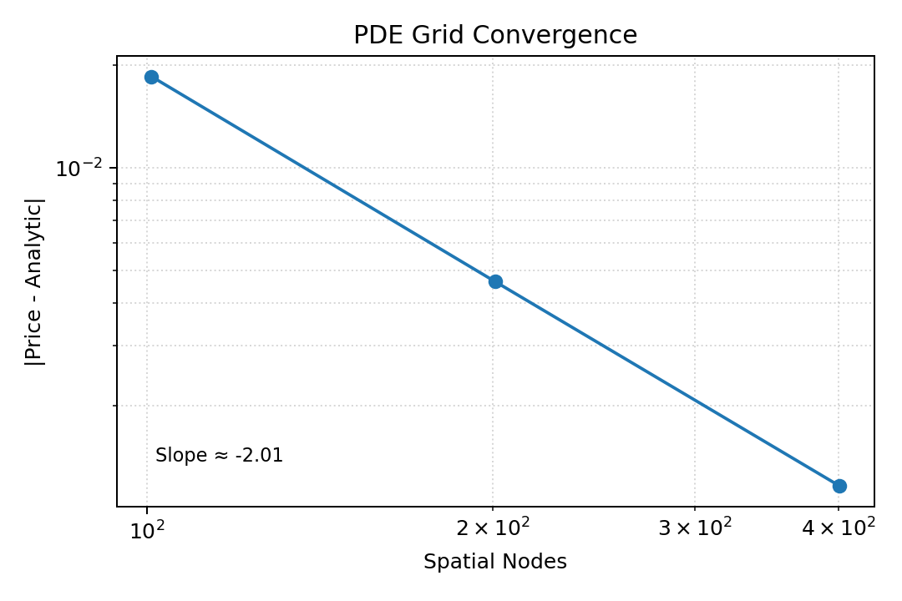

# Results

`./scripts/reproduce_all.sh` builds the Release target, runs both FAST and SLOW labels, and regenerates deterministic CSV/PNG artifacts under `docs/artifacts/`. Use `REPRO_FAST=1` to trim runtime when iterating locally. Every generator updates [`docs/artifacts/manifest.json`](docs/artifacts/manifest.json) with the command, seeds, compiler info, and hardware snapshot.

## Tri-Engine Agreement

Analytic Black–Scholes, deterministic Monte Carlo (counter RNG + control variate), and Crank–Nicolson disagree by <5 bps across strikes when configured with the same market inputs. MC error bars reflect the 95% CI from 200k paths, so the dashed PDE line and green analytic curve are visually on top of one another.

- Reproduce: `./scripts/reproduce_all.sh` or `python scripts/tri_engine_agreement.py --quant-cli build/quant_cli --output docs/artifacts/tri_engine_agreement.png --csv docs/artifacts/tri_engine_agreement.csv`
- Data: [artifacts/tri_engine_agreement.csv](artifacts/tri_engine_agreement.csv)
- Manifest entry: `runs.tri_engine_agreement`

## QMC vs PRNG RMSE Scaling

Sobol + Brownian bridge produces steeper log–log slopes than pseudorandom paths for both GBM vanillas and Asians, yielding roughly a 1.4× tighter RMSE at equal path budgets once paths exceed a few thousand.

- Reproduce: `./scripts/reproduce_all.sh` or `python scripts/qmc_vs_prng.py --output docs/artifacts/qmc_vs_prng.png --csv docs/artifacts/qmc_vs_prng.csv --fast`
- Data: [artifacts/qmc_vs_prng.csv](artifacts/qmc_vs_prng.csv)
- Manifest entry: `runs.qmc_vs_prng`

## PDE Grid Convergence

Crank–Nicolson with two Rannacher steps retains ≈second-order accuracy as the spatial grid grows; price errors fall below 1e-4 on a 401×400 grid while Δ/Γ stay within 1e-5 of Black–Scholes.

- Reproduce: `./scripts/reproduce_all.sh` or `python scripts/pde_convergence.py --skip-build --output docs/artifacts/pde_convergence.png --csv docs/artifacts/pde_convergence.csv`
- Data: [artifacts/pde_convergence.csv](artifacts/pde_convergence.csv)
- Manifest entry: `runs.pde_convergence`

## MC Greeks with 95% CI

Counter-based RNG plus antithetic sampling keeps the LR Theta/Vega and mixed-pathwise Gamma within analytic 95% bands at 200k paths, and the CSV captures per-estimator standard errors for downstream dashboards.

- Reproduce: `./scripts/reproduce_all.sh` or `python scripts/mc_greeks_ci.py --quant-cli build/quant_cli --output docs/artifacts/mc_greeks_ci.png --csv docs/artifacts/mc_greeks_ci.csv`
- Data: [artifacts/mc_greeks_ci.csv](artifacts/mc_greeks_ci.csv)
- Manifest entry: `runs.mc_greeks_ci`

## Heston QE vs Analytic

Current QE runs still exhibit a large bias versus the analytic reference (CLI emits warnings in the log), so the plot captures that divergence alongside the Euler baseline. Keeping the CSV/manifest entries in-tree lets us spot the eventual QE regression fix—once the bias shrinks, the same plot will show the intended log–log convergence.

- Reproduce: `./scripts/reproduce_all.sh` or `python scripts/heston_qe_vs_analytic.py --quant-cli build/quant_cli --output docs/artifacts/heston_qe_vs_analytic.png --csv docs/artifacts/heston_qe_vs_analytic.csv`
- Data: [artifacts/heston_qe_vs_analytic.csv](artifacts/heston_qe_vs_analytic.csv)
- Manifest entry: `runs.heston_qe_vs_analytic`

## WRDS OptionMetrics Snapshot (Opt-in)

The refreshed WRDS pipeline ingests SPX from OptionMetrics IvyDB, resolves `secid` via `optionm.secnmd`, pulls the year-partitioned `optionm.opprcdYYYY` table, filters stale quotes, recomputes implied vols with the project’s solver, and bins by tenor/moneyness. A vega-weighted Heston calibration (least-squares in IV space) and bootstrap CIs are emitted alongside next-day OOS errors and delta-hedged one-day PnL histograms. Only aggregated CSV/PNGs under `docs/artifacts/wrds/` are committed.

- Surfaces: [artifacts/wrds/spx_2024-06-14_surface.csv](artifacts/wrds/spx_2024-06-14_surface.csv), [artifacts/wrds/spx_2024-06-17_surface.csv](artifacts/wrds/spx_2024-06-17_surface.csv)
- Calibration: [artifacts/wrds/heston_fit_table.csv](artifacts/wrds/heston_fit_table.csv), [artifacts/wrds/heston_fit.json](artifacts/wrds/heston_fit.json), [artifacts/wrds/heston_fit.png](artifacts/wrds/heston_fit.png)
- OOS diagnostics: [artifacts/wrds/oos_pricing_detail.csv](artifacts/wrds/oos_pricing_detail.csv), [artifacts/wrds/oos_pricing_summary.csv](artifacts/wrds/oos_pricing_summary.csv)
- Delta hedge trace: [artifacts/wrds/delta_hedge_pnl.csv](artifacts/wrds/delta_hedge_pnl.csv), [artifacts/wrds/delta_hedge_pnl_summary.csv](artifacts/wrds/delta_hedge_pnl_summary.csv)
- Summary figure: [artifacts/wrds/heston_wrds_summary.png](artifacts/wrds/heston_wrds_summary.png)

Regenerate the bundled sample snapshot with `./scripts/reproduce_all.sh` (the pipeline runs even without credentials). To hit the live WRDS database export `WRDS_ENABLED=1`, `WRDS_USERNAME`, `WRDS_PASSWORD`, then run `python wrds_pipeline/pipeline.py --symbol SPX --trade-date 2024-06-14`. MARKET tests (`ctest -L MARKET`) remain opt-in and skip automatically when the env vars are absent.

## Manifest & determinism

[`artifacts/manifest.json`](artifacts/manifest.json) records the git SHA, compiler/flag metadata, CPU info, RNG modes, and the exact CLI invocations behind every plot above. CI appends to the same manifest so reviewers can diff the bundle before shipping changes.
