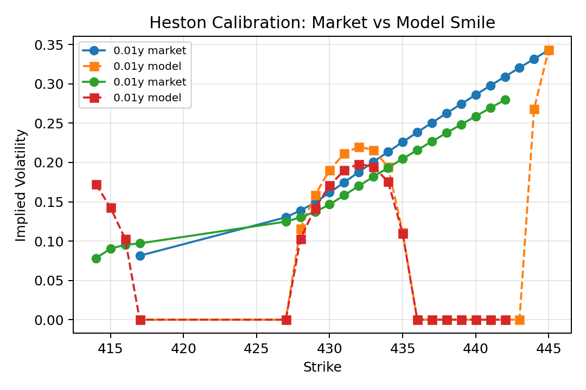
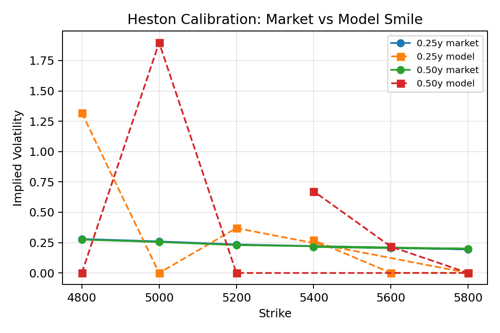
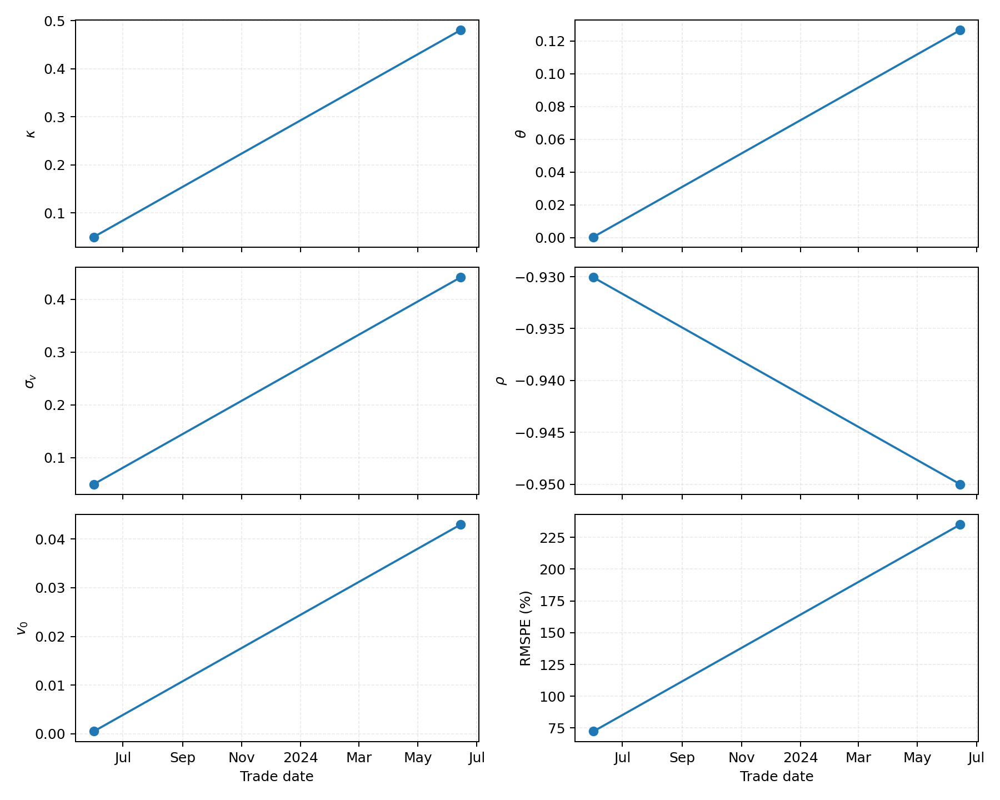
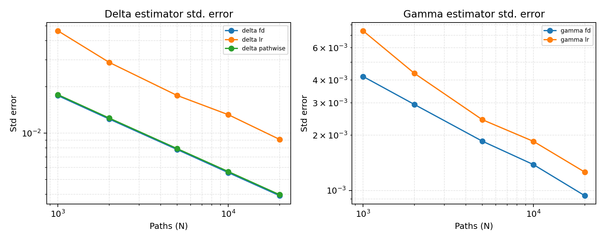

# Results

## Heston Smile Calibration (SPY 2023-06-01)
Real SPY surface from 1-Jun-2023 (CBOE) fitted with the characteristic‑function solver on 40 quotes (23 strikes × 2 expiries). Price RMSPE lands at **5.7%** after filtering to ±14% moneyness and allowing deeper Gauss–Laguerre work per restart.

```bash
python scripts/calibrate_heston.py \
  --input data/normalized/spy_20230601.csv \
  --metric price --max-evals 1200 --retries 6
```

- Params: [`artifacts/heston/params_20230601.json`](../artifacts/heston/params_20230601.json)
- Table: [`artifacts/heston/fit_20230601.csv`](../artifacts/heston/fit_20230601.csv)
- Manifest slice: [`artifacts/manifest.json`](../artifacts/manifest.json) → `runs.heston`, date `2023-06-01`
- Safety: weight_mode=`iv`, param_transform=`none`, Feller residual `-2.45e-03` (emit `--feller-warn` to surface the violation)



## Heston Smile Calibration (FAST Sample)
CI-friendly run on the bundled synthetic SPX slice (12 quotes) still hits the JSON/PNG/CSV pipeline and feeds the FAST tests.

```bash
python scripts/calibrate_heston.py --input data/samples/spx_20240614_sample.csv --fast
```

- Params: [`artifacts/heston/params_20240614.json`](../artifacts/heston/params_20240614.json)
- Table: [`artifacts/heston/fit_20240614.csv`](../artifacts/heston/fit_20240614.csv)
- Safety: weight_mode=`iv`, param_transform=`none`, Feller residual recorded in `manifest.json` (FAST run keeps warnings informational)



## Heston Parameter Series (FAST)
Tiny two-point series stitches the real SPY surface to the synthetic regression asset, illustrating how FAST calibrations (≈12 quotes per date) track parameter drift without blowing the PR budget.

```bash
python scripts/heston_series_plot.py \
  --inputs data/normalized/spy_20230601.csv data/samples/spx_20240614_sample.csv \
  --metric price --fast
```

- Series CSV: [`artifacts/heston/params_series.csv`](../artifacts/heston/params_series.csv)
- Manifest slice: [`artifacts/manifest.json`](../artifacts/manifest.json) → `runs.heston_params_series`



## Put–Call Parity Micro-Checks (FAST)
Parity residuals sit at machine precision and the digital finite-difference overlay tracks the analytic Black–Scholes digital price within 1e-4 across the grid.

```bash
python scripts/parity_checks.py --fast
```

- CSV: [`artifacts/parity_checks.csv`](../artifacts/parity_checks.csv)
- Manifest slice: [`artifacts/manifest.json`](../artifacts/manifest.json) → `runs.parity_checks`


## Greeks Reliability (FAST)
Pathwise Delta stays at ≈0.004 standard error by 20k paths, about **2× tighter** than the likelihood-ratio estimator; finite-difference Delta tracks closely thanks to common random numbers. Gamma shows the LR estimator still ~30% noisier than the bump-and-revalue approach even at 20k paths. The CSV records both variance and standard error per estimator so the micro-figure is auditable.

```bash
python scripts/greeks_reliability.py --fast
```

- Estimates: [`artifacts/greeks_reliability.csv`](../artifacts/greeks_reliability.csv)
- Manifest slice: [`artifacts/manifest.json`](../artifacts/manifest.json) → `runs.greeks_reliability`



## QMC vs PRNG RMSE Scaling
Sobol QMC shows the expected steeper error decay versus pseudorandom Monte Carlo for both the GBM call and arithmetic Asian payoffs; slopes come directly from randomized replicates stored in the CSV.

```bash
python scripts/qmc_vs_prng.py --fast
```

- Summary: [`artifacts/qmc_vs_prng.csv`](../artifacts/qmc_vs_prng.csv)
- Manifest slice: [`artifacts/manifest.json`](../artifacts/manifest.json)


## American Pricing Consistency
PSOR, CRR, and LSMC agree across the {0.8, 1.0, 1.2} × {0.2, 0.4} grid with LSMC spreads contained within the ±2σ bars, providing regression-quality parity for the American put implementations.

```bash
python scripts/american_consistency.py --fast
```

- Grid dump: [`artifacts/american_consistency.csv`](../artifacts/american_consistency.csv)
- Manifest slice: [`artifacts/manifest.json`](../artifacts/manifest.json)


## PDE Convergence Study
The log–log slope of −2.0± confirms second-order convergence of the Crank–Nicolson PDE engine over successively finer spatial meshes while staying within sub-basis runtime targets.

```bash
python scripts/pde_convergence.py --fast --skip-build
```

- Convergence series: [`artifacts/pde_convergence.csv`](../artifacts/pde_convergence.csv)
- Manifest slice: [`artifacts/manifest.json`](../artifacts/manifest.json)


