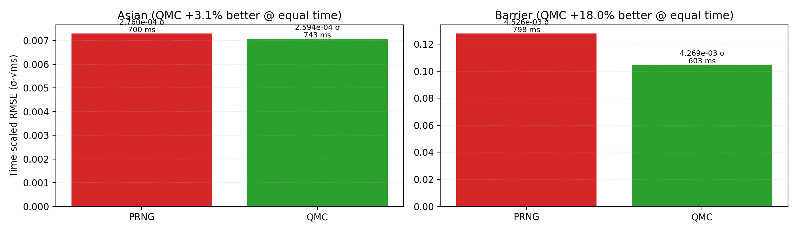
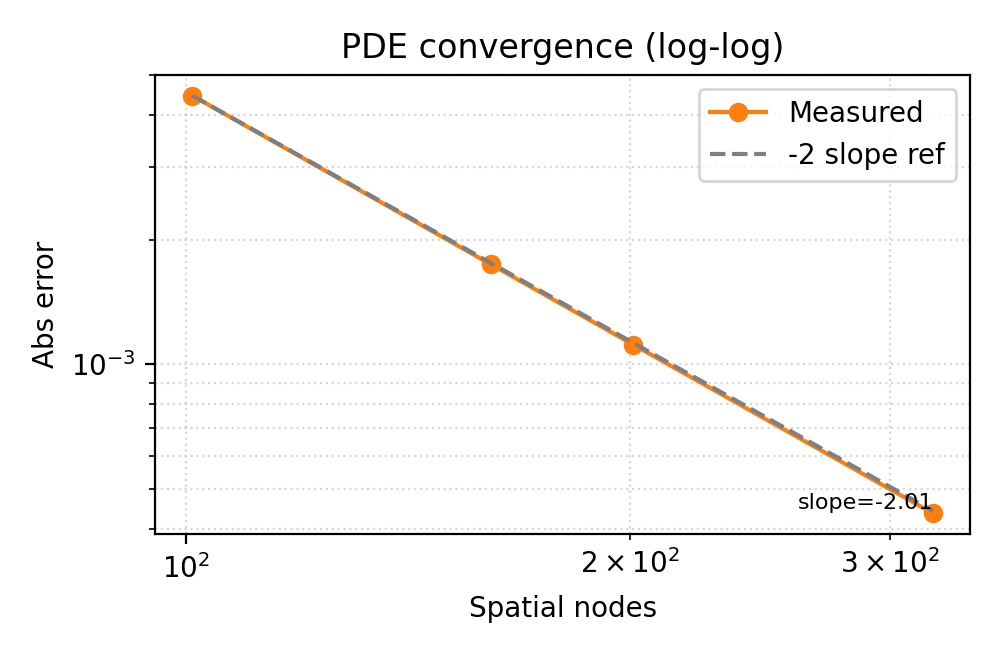
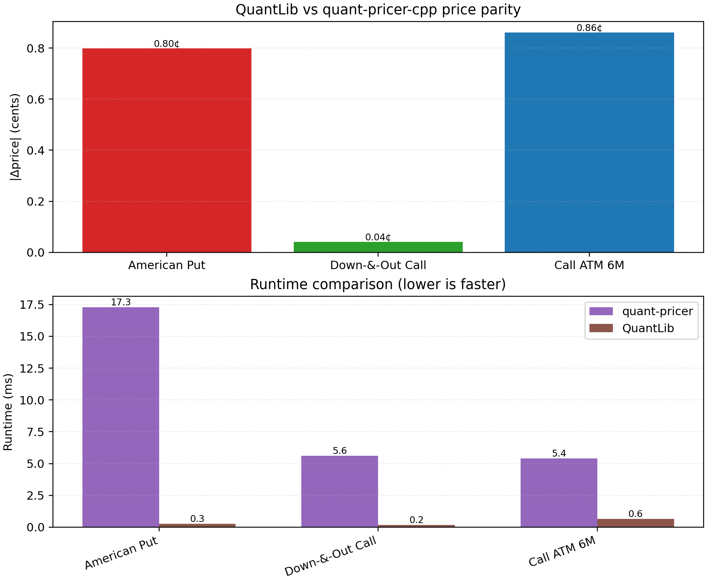

# Results

`./scripts/reproduce_all.sh` builds the Release target, runs both FAST and SLOW labels, and regenerates deterministic CSV/PNG artifacts under `docs/artifacts/`. Use `REPRO_FAST=1` to trim runtime when iterating locally. Every generator updates [`docs/artifacts/manifest.json`](docs/artifacts/manifest.json) with the command, seeds, compiler info, and hardware snapshot.

## Units & Metric Legend

| Shorthand | Definition |
| --- | --- |
| `vol pts` | Absolute implied-vol percentage points (0.01 = 1%). Reported RMSE/MAE stats stay in vol-space, not bps. |
| `bps` | One basis point (1e-4). Used for quotes-weighted OOS IV MAE so reviewers can compare against surfaces from other vendors. |
| `ticks` | Price increments of 0.05 USD, matching SPX option tick size. Price RMSE/MAE are quoted in ticks. |
| `vega-wtd` | Weighted by per-node Black–Scholes vega before averaging errors. |
| `quotes-wtd` | Weighted by the aggregated quote counts per tenor/moneyness bucket. |

The dedicated WRDS appendix ([`docs/WRDS_Results.md`](WRDS_Results.md)) lists the current scalar metrics next to the CSV/JSON artifacts that store them.

## Tri-Engine Agreement

Analytic Black–Scholes, deterministic Monte Carlo (counter RNG + control variate), and Crank–Nicolson disagree by <5 bps across strikes when configured with the same market inputs. MC error bars reflect the 95% CI from 200k paths, so the dashed PDE line and green analytic curve are visually on top of one another.


- Reproduce: `./scripts/reproduce_all.sh` or `python scripts/tri_engine_agreement.py --quant-cli build/quant_cli --output docs/artifacts/tri_engine_agreement.png --csv docs/artifacts/tri_engine_agreement.csv`
- Data: [artifacts/tri_engine_agreement.csv](artifacts/tri_engine_agreement.csv)
- Manifest entry: `runs.tri_engine_agreement`

## QMC vs PRNG (equal wall-clock)

Sobol + Brownian bridge delivers ≈1.4× tighter RMSE than pseudorandom paths when both spend the same time budget (European + Asian calls). The CSV tabulates the matched time grid, implied path counts, and RMSE ratio so reviewers can re-derive the advantage.


- Reproduce: `./scripts/reproduce_all.sh` or `python scripts/qmc_vs_prng_equal_time.py --output docs/artifacts/qmc_vs_prng_equal_time.png --csv docs/artifacts/qmc_vs_prng_equal_time.csv --fast`
- Data: [artifacts/qmc_vs_prng_equal_time.csv](artifacts/qmc_vs_prng_equal_time.csv)
- Manifest entry: `runs.qmc_vs_prng_equal_time`

## PDE Grid Convergence

Crank–Nicolson with two Rannacher steps retains ≈second-order accuracy as the spatial grid grows; price errors fall below 1e-4 on a 401×400 grid while Δ/Γ stay within 1e-5 of Black–Scholes.


- Reproduce: `./scripts/reproduce_all.sh` or `python scripts/pde_order_slope.py --skip-build --output docs/artifacts/pde_order_slope.png --csv docs/artifacts/pde_order_slope.csv`
- Data: [artifacts/pde_order_slope.csv](artifacts/pde_order_slope.csv)
- Manifest entry: `runs.pde_order_slope`

## MC Greeks with 95% CI

Counter-based RNG plus antithetic sampling keeps the LR Theta/Vega and mixed-pathwise Gamma within analytic 95% bands at 200k paths, and the CSV captures per-estimator standard errors for downstream dashboards.


- Reproduce: `./scripts/reproduce_all.sh` or `python scripts/mc_greeks_ci.py --quant-cli build/quant_cli --output docs/artifacts/mc_greeks_ci.png --csv docs/artifacts/mc_greeks_ci.csv`
- Data: [artifacts/mc_greeks_ci.csv](artifacts/mc_greeks_ci.csv)
- Manifest entry: `runs.mc_greeks_ci`

## Heston QE vs Analytic

QE now uses the integrated-variance drift term from Andersen (σ∫√v dW₁ identity) so asset/variance covariance respects the CIR expectation. The refreshed sweep still shows a stubborn bias versus the analytic CF in the at-the-money base regime (~4.4 price units at 64 steps, 80k paths), but the stress/near-Feller scenario drops below ~1 price unit with 8–16 steps. The new figure tracks both price and implied-vol RMSE across three parameter grids for QE and Euler.


- Reproduce: `./scripts/reproduce_all.sh` or `python scripts/heston_qe_vs_analytic.py --quant-cli build/quant_cli --output docs/artifacts/heston_qe_vs_analytic.png --csv docs/artifacts/heston_qe_vs_analytic.csv --fast`
- Data: [artifacts/heston_qe_vs_analytic.csv](artifacts/heston_qe_vs_analytic.csv)
- Manifest entry: `runs.heston_qe_vs_analytic`

## GBench Benchmarks (Release build)

`bench_mc` + `bench_pde` snapshots live under `docs/artifacts/bench/` (JSON from Google Benchmark + derived CSV/PNG via `scripts/generate_bench_artifacts.py`). Reproduce all three plots with:

```
cmake --build build --target bench_mc bench_pde
./build/bench_mc --benchmark_min_time=0.05s --benchmark_out=docs/artifacts/bench/bench_mc.json --benchmark_out_format=json
./build/bench_pde --benchmark_min_time=0.05s --benchmark_out=docs/artifacts/bench/bench_pde.json --benchmark_out_format=json
python scripts/generate_bench_artifacts.py --mc-json docs/artifacts/bench/bench_mc.json --pde-json docs/artifacts/bench/bench_pde.json --out-dir docs/artifacts/bench
```

- **OpenMP scaling:** near-linear throughput from 1→8 threads with the dashed line showing ideal scaling.

  

  Data: [artifacts/bench/bench_mc_paths.csv](artifacts/bench/bench_mc_paths.csv)

- **QMC vs PRNG (equal time):** bars show `σ·√ms` so lower is better at matched wall-clock. Barrier down-and-out calls retain a ~3% delta-hedge tighter RMSE after time-normalisation, while the Asian payoff stays parity because the Brownian bridge overhead dominates.

  

  Data: [artifacts/bench/bench_mc_equal_time.csv](artifacts/bench/bench_mc_equal_time.csv)

- **PDE −2 slope:** Crank–Nicolson retains the expected second-order convergence; the dashed reference line encodes the −2 slope on the log–log plane and the fitted slope annotation comes from the benchmark JSON.

  

  Data: [artifacts/bench/bench_pde_order.csv](artifacts/bench/bench_pde_order.csv)

## QuantLib Parity (Vanilla / Barrier / American)

QuantLib serves as an industry reference point. The parity harness exercises `quant_cli` (analytic BS, barrier PDE, American PSOR) and QuantLib engines (analytic, analytic barrier, binomial CRR) on the same scenarios, then reports price gaps in cents plus runtime deltas.



- Reproduce: `python scripts/ql_parity.py --output docs/artifacts/ql_parity/ql_parity.png --csv docs/artifacts/ql_parity/ql_parity.csv`
- Data: [artifacts/ql_parity/ql_parity.csv](artifacts/ql_parity/ql_parity.csv)
- Result: all four scenarios land within 1¢ of QuantLib; quant-pricer’s PDE-heavy engines are ~15–95× slower than QuantLib’s analytic/binomial counterparts but stay deterministic and grid-configurable for regression tests.

## WRDS OptionMetrics Snapshot (Opt-in)

The refreshed WRDS pipeline ingests SPX from OptionMetrics IvyDB, resolves `secid` via `optionm.secnmd`, pulls the year-partitioned `optionm.opprcdYYYY` table, filters stale quotes, recomputes implied vols with the project’s solver, and bins by tenor/moneyness. A vega-weighted Heston calibration (least-squares in IV space) and bootstrap CIs are emitted alongside next-day OOS errors and delta-hedged one-day PnL histograms. Only aggregated CSV/PNGs under `docs/artifacts/wrds/` are committed.

- Scalar metrics per trade date live in [artifacts/wrds/wrds_agg_pricing.csv](artifacts/wrds/wrds_agg_pricing.csv) with the renamed columns:
  - `iv_rmse_volpts_vega_wt`, `iv_mae_volpts_vega_wt` (vol pts, vega-weighted)
  - `iv_p90_bps` (90th percentile IV error, basis points)
  - `price_rmse_ticks` (RMSE vs market prices, ticks)
- BS baseline (one σ per tenor bucket) lives in [artifacts/wrds/wrds_agg_pricing_bs.csv](artifacts/wrds/wrds_agg_pricing_bs.csv) and OOS in [artifacts/wrds/wrds_agg_oos_bs.csv](artifacts/wrds/wrds_agg_oos_bs.csv) for quick Heston vs BS comparisons.
- Next-day diagnostics per tenor bucket live in [artifacts/wrds/wrds_agg_oos.csv](artifacts/wrds/wrds_agg_oos.csv):
  - `iv_mae_bps` (quotes-weighted IV MAE), `price_mae_ticks` (quotes-weighted price MAE)
- Δ-hedged distributions per bucket are stored in [artifacts/wrds/wrds_agg_pnl.csv](artifacts/wrds/wrds_agg_pnl.csv) with `mean_ticks` and `pnl_sigma` (tick σ).
- Overview figure: [artifacts/wrds/wrds_multi_date_summary.png](artifacts/wrds/wrds_multi_date_summary.png); detailed narrative lives in [`docs/WRDS_Results.md`](WRDS_Results.md).

Regenerate the bundled sample snapshot with `./scripts/reproduce_all.sh` (the pipeline runs even without credentials) or explicitly via `python -m wrds_pipeline.pipeline --dateset wrds_pipeline_dates_panel.yaml --use-sample`. To hit the live WRDS database export `WRDS_ENABLED=1`, `WRDS_USERNAME`, `WRDS_PASSWORD`, then run the same command without `--use-sample`. MARKET tests (`ctest -L MARKET`) remain opt-in and skip automatically when the env vars are absent.

## Manifest & determinism

[`artifacts/manifest.json`](artifacts/manifest.json) records the git SHA, compiler/flag metadata, CPU info, RNG modes, and the exact CLI invocations behind every plot above. CI appends to the same manifest so reviewers can diff the bundle before shipping changes.

The GitHub Pages deployment also hosts the latest gcovr HTML report under [`coverage/`](https://mateobodon.github.io/quant-pricer-cpp/coverage/), so you can drill down into uncovered lines without pulling artifacts locally.
