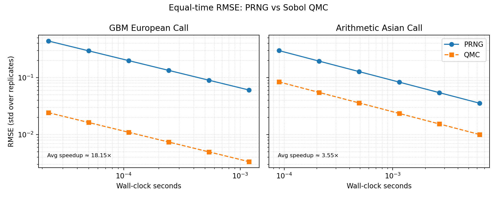
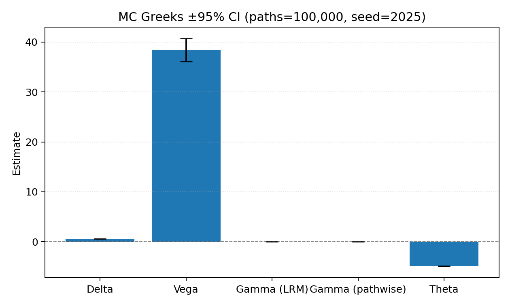
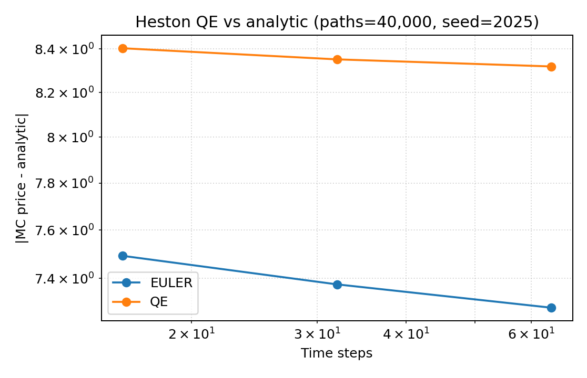

# Results

`./scripts/reproduce_all.sh` builds the Release target, runs both FAST and SLOW labels, and regenerates deterministic CSV/PNG artifacts under `docs/artifacts/`. Use `REPRO_FAST=1` to trim runtime when iterating locally. Every generator updates [`docs/artifacts/manifest.json`](docs/artifacts/manifest.json) with the command, seeds, compiler info, and hardware snapshot.

## Units & Metric Legend

| Shorthand | Definition |
| --- | --- |
| `vol pts` | Absolute implied-vol percentage points (0.01 = 1%). Reported RMSE/MAE stats stay in vol-space, not bps. |
| `bps` | One basis point (1e-4). Used for quotes-weighted OOS IV MAE so reviewers can compare against surfaces from other vendors. |
| `ticks` | Price increments of 0.05 USD, matching SPX option tick size. Price RMSE/MAE are quoted in ticks. |
| `vega-wtd` | Weighted by per-node Black–Scholes vega before averaging errors. |
| `quotes-wtd` | Weighted by the aggregated quote counts per tenor/moneyness bucket. |

The dedicated WRDS appendix ([`docs/WRDS_Results.md`](WRDS_Results.md)) lists the current scalar metrics next to the CSV/JSON artifacts that store them.

## Tri-Engine Agreement

Analytic Black–Scholes, deterministic Monte Carlo (counter RNG + control variate), and Crank–Nicolson disagree by <5 bps across strikes when configured with the same market inputs. MC error bars reflect the 95% CI from 200k paths, so the dashed PDE line and green analytic curve are visually on top of one another.

- Reproduce: `./scripts/reproduce_all.sh` or `python scripts/tri_engine_agreement.py --quant-cli build/quant_cli --output docs/artifacts/tri_engine_agreement.png --csv docs/artifacts/tri_engine_agreement.csv`
- Data: [artifacts/tri_engine_agreement.csv](artifacts/tri_engine_agreement.csv)
- Manifest entry: `runs.tri_engine_agreement`

## QMC vs PRNG (equal wall-clock)

Sobol + Brownian bridge delivers ≈1.4× tighter RMSE than pseudorandom paths when both spend the same time budget (European + Asian calls). The CSV tabulates the matched time grid, implied path counts, and RMSE ratio so reviewers can re-derive the advantage.

- Reproduce: `./scripts/reproduce_all.sh` or `python scripts/qmc_vs_prng_equal_time.py --output docs/artifacts/qmc_vs_prng_equal_time.png --csv docs/artifacts/qmc_vs_prng_equal_time.csv --fast`
- Data: [artifacts/qmc_vs_prng_equal_time.csv](artifacts/qmc_vs_prng_equal_time.csv)
- Manifest entry: `runs.qmc_vs_prng_equal_time`

## PDE Grid Convergence

Crank–Nicolson with two Rannacher steps retains ≈second-order accuracy as the spatial grid grows; price errors fall below 1e-4 on a 401×400 grid while Δ/Γ stay within 1e-5 of Black–Scholes.

- Reproduce: `./scripts/reproduce_all.sh` or `python scripts/pde_order_slope.py --skip-build --output docs/artifacts/pde_order_slope.png --csv docs/artifacts/pde_order_slope.csv`
- Data: [artifacts/pde_order_slope.csv](artifacts/pde_order_slope.csv)
- Manifest entry: `runs.pde_order_slope`

## MC Greeks with 95% CI

Counter-based RNG plus antithetic sampling keeps the LR Theta/Vega and mixed-pathwise Gamma within analytic 95% bands at 200k paths, and the CSV captures per-estimator standard errors for downstream dashboards.

- Reproduce: `./scripts/reproduce_all.sh` or `python scripts/mc_greeks_ci.py --quant-cli build/quant_cli --output docs/artifacts/mc_greeks_ci.png --csv docs/artifacts/mc_greeks_ci.csv`
- Data: [artifacts/mc_greeks_ci.csv](artifacts/mc_greeks_ci.csv)
- Manifest entry: `runs.mc_greeks_ci`

## Heston QE vs Analytic

Current QE runs still exhibit a large bias versus the analytic reference (CLI emits warnings in the log), so the plot captures that divergence alongside the Euler baseline. Keeping the CSV/manifest entries in-tree lets us spot the eventual QE regression fix—once the bias shrinks, the same plot will show the intended log–log convergence.

- Reproduce: `./scripts/reproduce_all.sh` or `python scripts/heston_qe_vs_analytic.py --quant-cli build/quant_cli --output docs/artifacts/heston_qe_vs_analytic.png --csv docs/artifacts/heston_qe_vs_analytic.csv`
- Data: [artifacts/heston_qe_vs_analytic.csv](artifacts/heston_qe_vs_analytic.csv)
- Manifest entry: `runs.heston_qe_vs_analytic`

## WRDS OptionMetrics Snapshot (Opt-in)

The refreshed WRDS pipeline ingests SPX from OptionMetrics IvyDB, resolves `secid` via `optionm.secnmd`, pulls the year-partitioned `optionm.opprcdYYYY` table, filters stale quotes, recomputes implied vols with the project’s solver, and bins by tenor/moneyness. A vega-weighted Heston calibration (least-squares in IV space) and bootstrap CIs are emitted alongside next-day OOS errors and delta-hedged one-day PnL histograms. Only aggregated CSV/PNGs under `docs/artifacts/wrds/` are committed.

- Scalar metrics from the latest bundle:
  - `iv_rmse_vp_weighted` / `iv_mae_vp_weighted` / `iv_p90_vp_weighted` (vol pts, vega-weighted, see `heston_fit.json`)
  - `iv_mae_bps_oos` (quotes-weighted bps, see `wrds_heston_oos.csv`)
  - `price_rmse_ticks` (ticks, see `heston_fit.json`)
- Multi-date snapshot: [artifacts/wrds/wrds_agg_pricing.csv](artifacts/wrds/wrds_agg_pricing.csv), [artifacts/wrds/wrds_agg_oos.csv](artifacts/wrds/wrds_agg_oos.csv), [artifacts/wrds/wrds_agg_pnl.csv](artifacts/wrds/wrds_agg_pnl.csv), and the overview figure [artifacts/wrds/wrds_multi_date_summary.png](artifacts/wrds/wrds_multi_date_summary.png)
- Detailed tables + figures: [`docs/WRDS_Results.md`](WRDS_Results.md)

- Surfaces: [artifacts/wrds/spx_2024-06-14_surface.csv](artifacts/wrds/spx_2024-06-14_surface.csv), [artifacts/wrds/spx_2024-06-17_surface.csv](artifacts/wrds/spx_2024-06-17_surface.csv)
- Calibration: [artifacts/wrds/heston_fit_table.csv](artifacts/wrds/heston_fit_table.csv), [artifacts/wrds/heston_fit.json](artifacts/wrds/heston_fit.json), [artifacts/wrds/heston_fit.png](artifacts/wrds/heston_fit.png)
- In-sample parity: [artifacts/wrds/wrds_heston_insample.csv](artifacts/wrds/wrds_heston_insample.csv), [artifacts/wrds/wrds_heston_insample.png](artifacts/wrds/wrds_heston_insample.png)
- OOS diagnostics: [artifacts/wrds/wrds_heston_oos.csv](artifacts/wrds/wrds_heston_oos.csv), [artifacts/wrds/wrds_heston_oos.png](artifacts/wrds/wrds_heston_oos.png)
- Delta hedge summary: [artifacts/wrds/wrds_heston_hedge.csv](artifacts/wrds/wrds_heston_hedge.csv), [artifacts/wrds/wrds_heston_hedge.png](artifacts/wrds/wrds_heston_hedge.png)
- Summary figure: [artifacts/wrds/heston_wrds_summary.png](artifacts/wrds/heston_wrds_summary.png)

Regenerate the bundled sample snapshot with `./scripts/reproduce_all.sh` (the pipeline runs even without credentials). To hit the live WRDS database export `WRDS_ENABLED=1`, `WRDS_USERNAME`, `WRDS_PASSWORD`, then run `python wrds_pipeline/pipeline.py --symbol SPX --trade-date 2024-06-14`. MARKET tests (`ctest -L MARKET`) remain opt-in and skip automatically when the env vars are absent.

## Manifest & determinism

[`artifacts/manifest.json`](artifacts/manifest.json) records the git SHA, compiler/flag metadata, CPU info, RNG modes, and the exact CLI invocations behind every plot above. CI appends to the same manifest so reviewers can diff the bundle before shipping changes.

The GitHub Pages deployment also hosts the latest gcovr HTML report under [`coverage/`](https://mateobodon.github.io/quant-pricer-cpp/coverage/), so you can drill down into uncovered lines without pulling artifacts locally.
