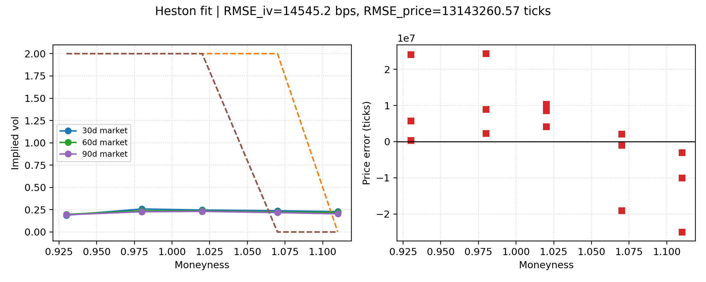
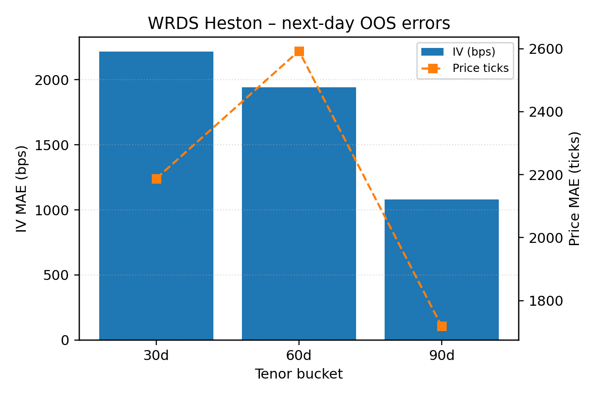
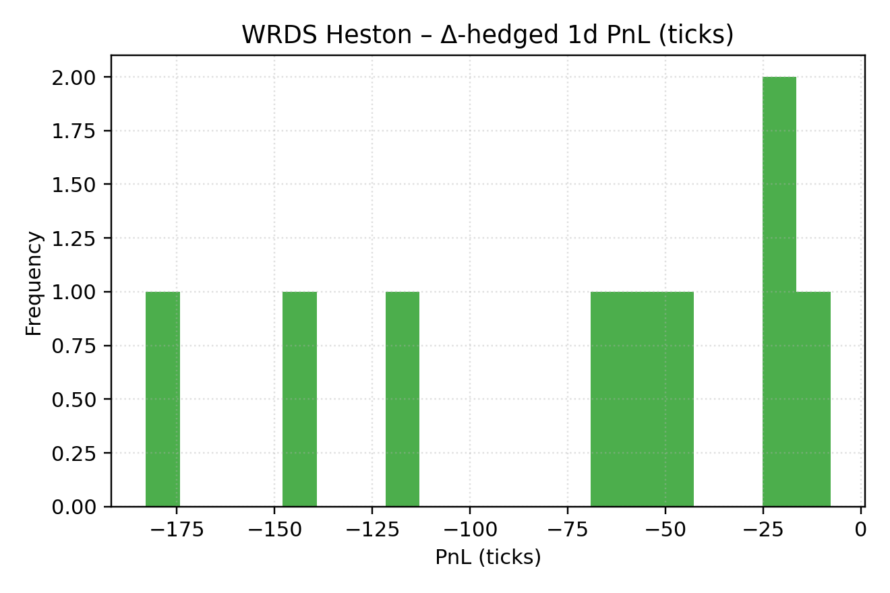

# WRDS Results

This appendix tracks the deterministic WRDS OptionMetrics bundle that lives under `docs/artifacts/wrds/`. Each refresh runs the same ingest → aggregate → vega-weighted Heston calibration → next-day OOS diagnostics → Δ-hedged P&L pipeline that MARKET tests exercise. All scalar metrics are written to CSV/JSON artifacts so reviewers can diff successive runs.

## Units & Metric Legend

| Shorthand | Definition |
| --- | --- |
| `vol pts` | Absolute implied-vol percentage points (0.01 = 1%). Used for all in-sample vega-weighted RMSE/MAE stats. |
| `bps` | One basis point (1e-4). Quotes-weighted `iv_mae_bps_oos` is reported in bps so it is comparable to vendor surfaces. |
| `ticks` | Price increments of 0.05 USD (SPX option tick size). Price RMSE stays in ticks for quick intuition. |
| `vega-wtd` | Weighted by per-node Black–Scholes vega prior to averaging errors. |
| `quotes-wtd` | Weighted by the bucketed quote counts; used for OOS MAE and hedge histograms. |

## Vega-weighted Calibration Snapshot

| Metric | Definition | Units | Artifact |
| --- | --- | --- | --- |
| `iv_rmse_vp_weighted` | Vega-weighted RMSE between model and market IVs. | `vol pts` | [`docs/artifacts/wrds/heston_fit.json`](artifacts/wrds/heston_fit.json) |
| `iv_mae_vp_weighted` | Vega-weighted MAE in vol space. | `vol pts` | [`docs/artifacts/wrds/heston_fit.json`](artifacts/wrds/heston_fit.json) |
| `iv_p90_vp_weighted` | Vega-weighted 90th percentile abs error. | `vol pts` | [`docs/artifacts/wrds/heston_fit.json`](artifacts/wrds/heston_fit.json) |
| `price_rmse_ticks` | RMSE of price errors, quoted in ticks. | `ticks` | [`docs/artifacts/wrds/heston_fit.json`](artifacts/wrds/heston_fit.json) |

## Out-of-sample & Hedge Diagnostics

| Metric | Definition | Units | Artifact |
| --- | --- | --- | --- |
| `iv_mae_bps_oos` | Quotes-weighted MAE of next-day IV errors. | `bps` | [`docs/artifacts/wrds/heston_fit.json`](artifacts/wrds/heston_fit.json) / [`docs/artifacts/wrds/wrds_heston_oos.csv`](artifacts/wrds/wrds_heston_oos.csv) |
| `mae_price_ticks` | Quotes-weighted MAE of next-day price errors. | `ticks` | [`docs/artifacts/wrds/wrds_heston_oos.csv`](artifacts/wrds/wrds_heston_oos.csv) |
| `mean_ticks` | Quotes-weighted mean Δ-hedged P&L per tenor bucket. | `ticks` | [`docs/artifacts/wrds/wrds_heston_hedge.csv`](artifacts/wrds/wrds_heston_hedge.csv) |

## Multi-date Dashboard (≥5 trade dates)

The batch runner iterates every entry in [`wrds_pipeline/dateset.yaml`](../wrds_pipeline/dateset.yaml)—mixing calm and stress labels—and writes one row per trade date under:

- [`docs/artifacts/wrds/wrds_agg_pricing.csv`](artifacts/wrds/wrds_agg_pricing.csv): vega-weighted fit metrics, labels, and provenance.
- [`docs/artifacts/wrds/wrds_agg_oos.csv`](artifacts/wrds/wrds_agg_oos.csv): tenor-by-date OOS IV/price MAE with quote counts.
- [`docs/artifacts/wrds/wrds_agg_pnl.csv`](artifacts/wrds/wrds_agg_pnl.csv): Δ-hedged P&L stats per tenor bucket.
- [`docs/artifacts/wrds/wrds_multi_date_summary.png`](artifacts/wrds/wrds_multi_date_summary.png): overview figure (vega-wtd IV RMSE bars, OOS MAE heatmap, hedge mean ticks).

Run `python -m wrds_pipeline.pipeline --dateset wrds_pipeline/dateset.yaml --use-sample` for the deterministic bundle, or drop `--use-sample` (with `WRDS_ENABLED=1`) to pull live IvyDB data.

## Reproducing this bundle

1. `./scripts/reproduce_all.sh` – builds Release, runs FAST+SLOW tests, and refreshes every artifact (WRDS sample bundle runs without credentials).
2. `python wrds_pipeline/pipeline.py --symbol SPX --trade-date YYYY-MM-DD` – direct control for ad-hoc WRDS dates. Set `WRDS_ENABLED=1` with `WRDS_USERNAME`/`WRDS_PASSWORD` to hit live IvyDB; otherwise the committed sample runs.

Each run appends to [`docs/artifacts/manifest.json`](artifacts/manifest.json) with the git SHA, compiler, seed pack, CPU info, and the command used to regenerate the WRDS bundle.
