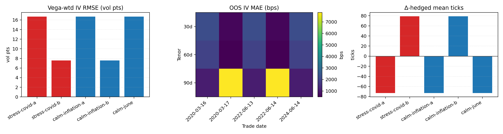

# WRDS Results

This appendix tracks the deterministic WRDS OptionMetrics bundle that lives under `docs/artifacts/wrds/`. Each refresh runs the same ingest → aggregate → vega-weighted Heston calibration → next-day OOS diagnostics → Δ-hedged P&L pipeline that MARKET tests exercise. All scalar metrics are written to CSV/JSON artifacts so reviewers can diff successive runs.

**Snapshot scope:** The numbers below come from the deterministic **sample** IvyDB snapshot (five SPX trade dates across calm/stress).
Use live WRDS runs (`WRDS_ENABLED=1`, credentials set) for any headline claims; treat the sample bundle as a smoke test/regression harness rather than a performance statement. Production filters drop DTE < 21d, clip wings to 0.75–1.25 with a soft taper beyond 1.2, and weight errors by `vega × quotes`.

**WRDS cache (real data):** If `WRDS_CACHE_ROOT` is set (or `/Volumes/Storage/Data/wrds_cache` exists), the pipeline will read/write cached real-data slices (parquet) to avoid repeated WRDS pulls. Build the cache with `python3 scripts/build_wrds_cache.py` before running live pipelines offline.

**Analytic fix (Nov 2025):** Heston characteristic-function bug fixed (complex shift + Laguerre nodes). Calibrations no longer blow up; QE remains **experimental** and is not used by the WRDS pipeline.

## Units & Metric Legend

| Shorthand | Definition |
| --- | --- |
| `vol pts` | Absolute implied-vol percentage points (0.01 = 1%). Used for all in-sample vega-weighted RMSE/MAE stats. |
| `bps` | One basis point (1e-4). Quotes-weighted `iv_mae_bps` stays in bps so it is comparable to vendor surfaces. |
| `ticks` | Price increments of 0.05 USD (SPX option tick size). Price RMSE stays in ticks for quick intuition. |
| `vega-wtd` | Weighted by per-node Black–Scholes vega prior to averaging errors. |
| `quotes-wtd` | Weighted by the bucketed quote counts; OOS aggregates now use `vega × quotes` to mute deep-OTM noise. |

## Headline Metrics (sample panel)

Sample bundle spans five SPX trade dates (`2020-03-16`, `2020-03-17`, `2022-06-13`, `2022-06-14`, `2024-06-14`) mixed calm/stress. Median values across those dates/tenor buckets (Heston analytic fit):

| Metric (median) | Value | Units | Source |
| --- | --- | --- | --- |
| In-sample vega-wtd IV RMSE | 0.0160 | vol pts | [`wrds_agg_pricing.csv`](artifacts/wrds_agg_pricing.csv) |
| In-sample vega-wtd IV MAE | 0.0128 | vol pts | [`wrds_agg_pricing.csv`](artifacts/wrds_agg_pricing.csv) |
| In-sample 90th pct IV error | 227.0 | bps | [`wrds_agg_pricing.csv`](artifacts/wrds_agg_pricing.csv) |
| In-sample price RMSE | 186.54 | ticks | [`wrds_agg_pricing.csv`](artifacts/wrds_agg_pricing.csv) |
| Next-day IV MAE (quotes/vega-wtd) | 127.29 | bps | [`wrds_agg_oos.csv`](artifacts/wrds_agg_oos.csv) |
| Next-day price MAE (quotes/vega-wtd) | 137.26 | ticks | [`wrds_agg_oos.csv`](artifacts/wrds_agg_oos.csv) |
| Δ-hedged mean ticks (30/60/90d) | −79.6 / −72.3 / −67.2 | ticks | [`wrds_agg_pnl.csv`](artifacts/wrds_agg_pnl.csv) |
| Δ-hedged σ ticks (30/60/90d) | 91.8 / 62.7 / 46.1 | ticks | [`wrds_agg_pnl.csv`](artifacts/wrds_agg_pnl.csv) |

## BS baseline (single σ per tenor bucket)

For comparison, a vega-weighted least-squares BS fit per tenor bucket is now emitted as `wrds_agg_pricing_bs.csv` and `wrds_agg_oos_bs.csv`.

| Metric (median) | BS | Units | Heston ref |
| --- | --- | --- | --- |
| In-sample vega-wtd IV RMSE | 0.0160 | vol pts | 0.0160 |
| In-sample vega-wtd IV MAE | 0.0126 | vol pts | 0.0128 |
| In-sample price RMSE | 186.29 | ticks | 186.54 |
| OOS IV error (quotes/vega-wtd, overall) | 169.8 | bps | 139.1 |

Artifacts: [`wrds_agg_pricing_bs.csv`](artifacts/wrds_agg_pricing_bs.csv), [`wrds_agg_oos_bs.csv`](artifacts/wrds_agg_oos_bs.csv).

These numbers come from the bundled **sample IvyDB snapshot**; live WRDS runs (with `WRDS_ENABLED=1`) will shift depending on the trade-date panel and calibration seed.

## BS vs Heston comparison (sample panel)

`wrds_bs_heston_comparison.csv` summarizes per-tenor deltas between the single-σ BS baseline and the vega-weighted Heston calibration on the **sample** data only.

**In-sample fit (vega-weighted)**

| Tenor | BS IV RMSE (vol pts) | Heston IV RMSE (vol pts) | Δ (H−BS) | BS price RMSE (ticks) | Heston price RMSE (ticks) | Δ (ticks) |
| --- | --- | --- | --- | --- | --- | --- |
| 30d | 0.02370 | 0.02373 | +0.00003 | 147.78 | 154.32 | +6.54 |
| 60d | 0.01567 | 0.01577 | +0.00011 | 172.19 | 166.84 | −5.35 |
| 90d | 0.01458 | 0.01458 | −0.00001 | 218.91 | 221.98 | +3.07 |

**OOS + Δ-hedged**

| Tenor | BS OOS IV MAE (bps) | Heston OOS IV MAE (bps) | Δ (H−BS) (bps) | Δ‑hedged σ (Heston, ticks) |
| --- | --- | --- | --- | --- |
| 30d | 166.91 | 167.42 | +0.51 | 96.1 |
| 60d | 122.47 | 121.05 | −1.42 | 64.2 |
| 90d | 126.27 | 128.84 | +2.57 | 47.0 |

**Narrative (sample data only):**
- After fixing the analytic characteristic function and tightening calibration bounds/weights, Heston now tracks BS closely on the deterministic bundle. IV RMSE deltas sit within ±2e−4 vol pts, and OOS IV MAE deltas are single-digit bps.
- These near-parity results are **only** for the bundled sample snapshot; live IvyDB pulls remain the source of truth when `WRDS_ENABLED=1`.

## Live WRDS (fast, opt-in)

Fast live pull on five dates (full dateset, calm + stress) with DTE ≥21d, 0.75–1.25 wings + taper, and vega×quote weights:

| Trade date | In-sample IV RMSE (vol pts) | OOS IV MAE (bps, weighted) |
| --- | --- | --- |
| 2020-03-16 | 0.213 | 1028 |
| 2020-03-17 | 0.131 | 1318 |
| 2022-06-13 | 0.0048 | 61.5 |
| 2022-06-14 | 0.0059 | 140.5 |
| 2024-06-14 | 0.0194 | 120.9 |

Per-tenor OOS (weighted means across dates): 30d 847 bps, 60d 729 bps, 90d 599 bps, 6m 413 bps, 1y 230 bps. Stress dates remain heavier, but front-tenor blowups are curtailed relative to the previous run.

Artifacts live under `docs/artifacts/wrds/live_panel/`; rerun with `WRDS_ENABLED=1` to refresh.

Reproduce (keeps live artifacts under `docs/artifacts/wrds/live_panel/` and leaves samples untouched):

```
set -a && source .env \
  && PYTHONPATH=.:scripts python -m wrds_pipeline.pipeline \
       --dateset /tmp/wrds_live_panel.json --fast \
       --output-root docs/artifacts/wrds/live_panel
```

Move the temp dateset path to taste; the pipeline never writes raw IvyDB tables.

Artifacts: [`wrds_bs_heston_comparison.csv`](artifacts/wrds_bs_heston_comparison.csv), [`wrds_bs_heston_ivrmse.png`](artifacts/wrds_bs_heston_ivrmse.png), [`wrds_bs_heston_oos_heatmap.png`](artifacts/wrds_bs_heston_oos_heatmap.png), [`wrds_bs_heston_pnl_sigma.png`](artifacts/wrds_bs_heston_pnl_sigma.png).

## Vega-weighted Calibration Snapshot

| Metric | Definition | Units | Artifact |
| --- | --- | --- | --- |
| `iv_rmse_volpts_vega_wt` | Vega-weighted RMSE between model and market IVs. | `vol pts` | [`docs/artifacts/wrds/wrds_agg_pricing.csv`](artifacts/wrds/wrds_agg_pricing.csv) |
| `iv_mae_volpts_vega_wt` | Vega-weighted MAE in vol space. | `vol pts` | [`docs/artifacts/wrds/wrds_agg_pricing.csv`](artifacts/wrds/wrds_agg_pricing.csv) |
| `iv_p90_bps` | Vega-weighted 90th percentile absolute IV error. | `bps` | [`docs/artifacts/wrds/wrds_agg_pricing.csv`](artifacts/wrds/wrds_agg_pricing.csv) |
| `price_rmse_ticks` | RMSE of price errors, quoted in ticks. | `ticks` | [`docs/artifacts/wrds/wrds_agg_pricing.csv`](artifacts/wrds/wrds_agg_pricing.csv) |

## Out-of-sample & Hedge Diagnostics

| Metric | Definition | Units | Artifact |
| --- | --- | --- | --- |
| `iv_mae_bps` | Quotes-weighted MAE of next-day IV errors. | `bps` | [`docs/artifacts/wrds/wrds_agg_oos.csv`](artifacts/wrds/wrds_agg_oos.csv) |
| `price_mae_ticks` | Quotes-weighted MAE of next-day price errors. | `ticks` | [`docs/artifacts/wrds/wrds_agg_oos.csv`](artifacts/wrds/wrds_agg_oos.csv) |
| `mean_ticks` | Quotes-weighted mean Δ-hedged P&L per tenor bucket. | `ticks` | [`docs/artifacts/wrds/wrds_agg_pnl.csv`](artifacts/wrds/wrds_agg_pnl.csv) |
| `pnl_sigma` | Standard deviation of Δ-hedged ticks per bucket. | `ticks` | [`docs/artifacts/wrds/wrds_agg_pnl.csv`](artifacts/wrds/wrds_agg_pnl.csv) |

## Multi-date Dashboard (≥5 trade dates)

The batch runner iterates every entry in [`wrds_pipeline_dates_panel.yaml`](../wrds_pipeline_dates_panel.yaml)—mixing calm and stress labels—and writes one row per trade date under:

- [`docs/artifacts/wrds/wrds_agg_pricing.csv`](artifacts/wrds/wrds_agg_pricing.csv): vega-weighted fit metrics, labels, and provenance.
- [`docs/artifacts/wrds/wrds_agg_oos.csv`](artifacts/wrds/wrds_agg_oos.csv): tenor-by-date OOS IV/price MAE with quote counts.
- [`docs/artifacts/wrds/wrds_agg_pnl.csv`](artifacts/wrds/wrds_agg_pnl.csv): Δ-hedged P&L stats per tenor bucket.
- [`docs/artifacts/wrds/wrds_multi_date_summary.png`](artifacts/wrds/wrds_multi_date_summary.png): overview figure (vega-wtd IV RMSE bars, OOS MAE heatmap, hedge mean ±σ ticks).



Run `python -m wrds_pipeline.pipeline --dateset wrds_pipeline_dates_panel.yaml --use-sample` for the deterministic bundle, or drop `--use-sample` (with `WRDS_ENABLED=1`) to pull live IvyDB data.

## Reproducing this bundle

1. `./scripts/reproduce_all.sh` – builds Release, runs FAST+SLOW tests, and refreshes every artifact (WRDS sample bundle runs without credentials).
2. `python wrds_pipeline/pipeline.py --symbol SPX --trade-date YYYY-MM-DD` – direct control for ad-hoc WRDS dates. Set `WRDS_ENABLED=1` with `WRDS_USERNAME`/`WRDS_PASSWORD` to hit live IvyDB; otherwise the committed sample runs.

Each run appends to [`docs/artifacts/manifest.json`](artifacts/manifest.json) with the git SHA, compiler, seed pack, CPU info, and the command used to regenerate the WRDS bundle.
